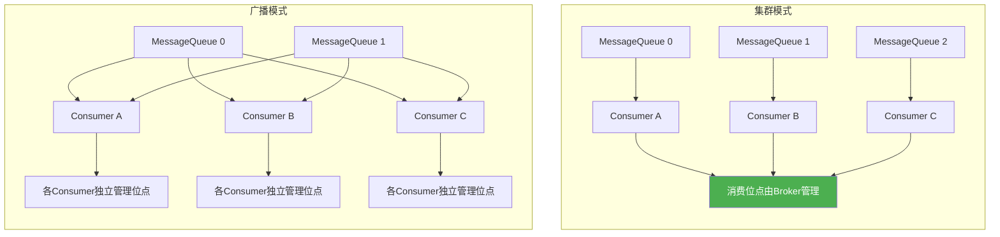

# RocketMQ 面试总结与使用指南

> 全面覆盖 RocketMQ 核心架构、消息模型、高级特性、性能优化、实战应用及高频面试题

---

## 目录

- [1. RocketMQ 概述](#1-rocketmq-概述)
- [2. 核心架构设计](#2-核心架构设计)
- [3. 消息模型](#3-消息消息模型)
- [4. 消息发送与消费](#4-消息发送与消费)
- [5. 高级特性](#5-高级特性)
- [6. 高可用与集群](#6-高可用与集群)
- [7. 性能优化](#7-性能优化)
- [8. 实战应用](#8-实战应用)
- [9. 常见问题排查](#9-常见问题排查)
- [10. 高频面试题解析](#10-高频面试题解析)

---

## 1. RocketMQ 概述

### 1.1 简介

```
┌─────────────────────────────────────────────────────────────────────┐
│                        RocketMQ 定位                                 │
├─────────────────────────────────────────────────────────────────────┤
│                                                                     │
│  开发方:  Apache 软件基金会 (原阿里巴巴开源)                          │
│  语言:    Java                                                      │
│  类型:    分布式消息中间件                                           │
│  特点:    高吞吐、低延迟、高可靠、海量消息堆积                        │
│                                                                     │
│  核心数据 (参考值):                                                  │
│  ┌──────────────────────────────────────────────────────────────┐   │
│  │ 单机 TPS:       10万+ 级别                                   │   │
│  │ 消息延迟:       毫秒级 (通常 < 5ms)                          │   │
│  │ 消息堆积:       亿级别 (磁盘顺序写)                          │   │
│  │ 单队列堆积:     千万级别不影响性能                           │   │
│  └──────────────────────────────────────────────────────────────┘   │
│                                                                     │
└─────────────────────────────────────────────────────────────────────┘
```

### 1.2 RocketMQ vs Kafka vs RabbitMQ

| 特性 | RocketMQ | Kafka | RabbitMQ |
|------|----------|-------|----------|
| **开发语言** | Java | Scala/Java | Erlang |
| **吞吐量** | 10万+ | 百万级 | 万级 |
| **延迟** | 毫秒级 | 毫秒级 | 微秒级 |
| **消息可靠性** | 高 | 高 | 极高 |
| **消息堆积** | 亿级 | 亿级 | 百万级 |
| **事务消息** | ✅ 原生支持 | ❌ 需自行实现 | ❌ 需插件 |
| **定时消息** | ✅ 支持 | ❌ 不支持 | ⚠️ 插件支持 |
| **顺序消息** | ✅ 支持 | ✅ 支持 | ⚠️ 单队列 |
| **消息回溯** | ✅ 支持时间范围 | ✅ 支持offset | ❌ 不支持 |
| **适用场景** | 业务消息 | 日志/大数据 | 企业级消息 |

### 1.3 核心应用场景

```
┌─────────────────────────────────────────────────────────────────────┐
│                      RocketMQ 应用场景                                │
├─────────────────────────────────────────────────────────────────────┤
│                                                                     │
│  1. 异步解耦                                                        │
│     订单系统 → [RocketMQ] → 积分系统 / 库存系统 / 通知系统          │
│                                                                     │
│  2. 削峰填谷                                                        │
│     秒杀请求 → [RocketMQ] → 按消费能力处理                          │
│                                                                     │
│  3. 异步通知                                                        │
│     支付成功 → [RocketMQ] → 短信通知 / App推送 / 邮件               │
│                                                                     │
│  4. 分布式事务                                                      │
│     转账操作 → [事务消息] → 保证最终一致性                          │
│                                                                     │
│  5. 数据同步                                                        │
│     MySQL CDC → [RocketMQ] → Elasticsearch / Redis / 数据仓库      │
│                                                                     │
│  6. 日志收集                                                        │
│     应用日志 → [RocketMQ] → 日志分析平台                            │
│                                                                     │
└─────────────────────────────────────────────────────────────────────┘
```

---

## 2. 核心架构设计

### 2.1 整体架构图

```
┌─────────────────────────────────────────────────────────────────────────────┐
│                          RocketMQ 整体架构                                    │
├─────────────────────────────────────────────────────────────────────────────┤
│                                                                             │
│  ┌─────────────────┐                                                        │
│  │   Producer Group │  (生产者集群)                                         │
│  │  ┌───┐ ┌───┐    │                                                        │
│  │  │P1 │ │P2 │    │                                                        │
│  │  └───┘ └───┘    │                                                        │
│  └────────┬────────┘                                                        │
│           │                                                                 │
│           │ 1. 从 NameServer 获取路由信息                                    │
│           ▼                                                                 │
│  ┌─────────────────────────────────────────────────────────┐                │
│  │                    NameServer 集群                       │                │
│  │  ┌──────────┐  ┌──────────┐  ┌──────────┐              │                │
│  │  │NameServer│  │NameServer│  │NameServer│  (互相独立)   │                │
│  │  │    1     │  │    2     │  │    3     │              │                │
│  │  └──────────┘  └──────────┘  └──────────┘              │                │
│  │  职责: 路由信息管理、Broker注册发现、心跳检测            │                │
│  └─────────────────────────────────────────────────────────┘                │
│           │                                                                 │
│           │ 2. Broker 向 NameServer 注册并定期心跳                          │
│           ▼                                                                 │
│  ┌─────────────────────────────────────────────────────────┐                │
│  │                    Broker 集群                           │                │
│  │                                                         │                │
│  │  ┌─────────────────────┐    ┌─────────────────────┐    │                │
│  │  │    Broker (Master)   │◄──►│   Broker (Slave)    │    │                │
│  │  │  Topic-A / Topic-B  │ 同步 │  Topic-A / Topic-B │    │                │
│  │  │  ┌───────────────┐  │/异步 │ ┌───────────────┐  │    │                │
│  │  │  │ CommitLog     │  │    │ │ CommitLog     │  │    │                │
│  │  │  │ ConsumeQueue  │  │    │ │ ConsumeQueue  │  │    │                │
│  │  │  │ IndexFile     │  │    │ │ IndexFile     │  │    │                │
│  │  │  └───────────────┘  │    │ └───────────────┘  │    │                │
│  │  └─────────────────────┘    └─────────────────────┘    │                │
│  │                                                         │                │
│  └─────────────────────────────────────────────────────────┘                │
│           │                                                                 │
│           │ 3. 消费者从 Broker 拉取消息                                     │
│           ▼                                                                 │
│  ┌─────────────────┐                                                        │
│  │ Consumer Group   │  (消费者集群)                                         │
│  │  ┌───┐ ┌───┐    │                                                        │
│  │  │C1 │ │C2 │    │                                                        │
│  │  └───┘ └───┘    │                                                        │
│  └─────────────────┘                                                        │
│                                                                             │
└─────────────────────────────────────────────────────────────────────────────┘
```

### 2.2 四大核心组件

```
┌─────────────────────────────────────────────────────────────────────┐
│                       四大核心组件                                    │
├─────────────────────────────────────────────────────────────────────┤
│                                                                     │
│  ┌─────────────────────────────────────────────────────────────┐   │
│  │ NameServer (路由注册中心)                                    │   │
│  │ ─────────────────────────────────────────────────────────── │   │
│  │ • 轻量级服务发现组件                                         │   │
│  │ • 各节点互相独立，不互相通信                                  │   │
│  │ • Broker 每 30s 向所有 NameServer 发送心跳                  │   │
│  │ • Producer/Consumer 每 30s 获取路由信息                      │   │
│  │ • 120s 未收到心跳 → 移除 Broker 节点                         │   │
│  │ • 支持静态配置                                                │   │
│  └─────────────────────────────────────────────────────────────┘   │
│                                                                     │
│  ┌─────────────────────────────────────────────────────────────┐   │
│  │ Broker (消息存储与转发)                                      │   │
│  │ ─────────────────────────────────────────────────────────── │   │
│  │ • 消息存储: CommitLog (所有消息顺序写入)                     │   │
│  │ • 索引构建: ConsumeQueue (逻辑队列索引)                      │   │
│  │ • 索引服务: IndexFile (按Key/时间范围查询)                   │   │
│  │ • 主从架构: Master 读写 / Slave 只读                         │   │
│  │ • 高可用: 主节点宕机后可切换到从节点                         │   │
│  └─────────────────────────────────────────────────────────────┘   │
│                                                                     │
│  ┌─────────────────────────────────────────────────────────────┐   │
│  │ Producer (消息生产者)                                        │   │
│  │ ─────────────────────────────────────────────────────────── │   │
│  │ • Producer Group: 同组内生产者发送同一类消息                 │   │
│  │ • 发送方式: 同步/异步/单向                                   │   │
│  │ • 负载均衡: 轮询/指定/一致性哈希                             │   │
│  │ • 重试机制: 发送失败自动重试 (默认2次)                       │   │
│  └─────────────────────────────────────────────────────────────┘   │
│                                                                     │
│  ┌─────────────────────────────────────────────────────────────┐   │
│  │ Consumer (消息消费者)                                        │   │
│  │ ─────────────────────────────────────────────────────────── │   │
│  │ • Consumer Group: 同组内消费者共享消费进度                   │   │
│  │ • 消费模式: 集群/广播                                        │   │
│  │ • 消费方式: Push(本质是Pull) / Pull                          │   │
│  │ • 消费位点: 本地文件 / Broker 远程管理                       │   │
│  └─────────────────────────────────────────────────────────────┘   │
│                                                                     │
└─────────────────────────────────────────────────────────────────────┘
```

### 2.3 存储架构

```
┌─────────────────────────────────────────────────────────────────────┐
│                      Broker 存储架构                                  │
├─────────────────────────────────────────────────────────────────────┤
│                                                                     │
│  ┌─────────────────────────────────────────────────────────────┐   │
│  │ CommitLog (消息物理存储文件)                                 │   │
│  │ ─────────────────────────────────────────────────────────── │   │
│  │ • 所有 Topic 的消息顺序写入同一个文件                        │   │
│  │ • 每个文件固定大小: 1GB (1073741824 bytes)                  │   │
│  │ • 文件名: 起始偏移量 (如 00000000000000000000)               │   │
│  │ • 写入方式: 内存映射 (MMap) + 顺序写                         │   │
│  │ • 刷盘方式: 同步刷盘 / 异步刷盘                              │   │
│  │                                                             │   │
│  │  ┌─────────────────────────────────────────────────────┐   │   │
│  │  │ msg1(TopicA) │ msg2(TopicB) │ msg3(TopicA) │ ...   │   │   │
│  │  └─────────────────────────────────────────────────────┘   │   │
│  └─────────────────────────────────────────────────────────────┘   │
│                           │                                         │
│                           │ ReputMessageService 异步构建             │
│                           ▼                                         │
│  ┌─────────────────────────────────────────────────────────────┐   │
│  │ ConsumeQueue (逻辑消费队列)                                  │   │
│  │ ─────────────────────────────────────────────────────────── │   │
│  │ • 每个 Topic 的每个 Queue 对应一个 ConsumeQueue              │   │
│  │ • 存储: CommitLog Offset (8B) + MsgSize (4B) + TagHash (8B) │   │
│  │ • 每条记录固定 20 字节                                       │   │
│  │ • 文件大小: 30万条 × 20B ≈ 5.72MB                           │   │
│  │                                                             │   │
│  │  TopicA/Queue0:                                             │   │
│  │  ┌──────────┬──────────┬──────────┬──────────┐             │   │
│  │  │ offset=0 │ offset=1 │ offset=2 │ ...     │             │   │
│  │  │ size=100 │ size=120 │ size=80  │         │             │   │
│  │  │ tag=abc  │ tag=def  │ tag=abc  │         │             │   │
│  │  └──────────┴──────────┴──────────┴──────────┘             │   │
│  └─────────────────────────────────────────────────────────────┘   │
│                           │                                         │
│                           │ IndexFile 构建线程                       │
│                           ▼                                         │
│  ┌─────────────────────────────────────────────────────────────┐   │
│  │ IndexFile (哈希索引文件)                                     │   │
│  │ ─────────────────────────────────────────────────────────── │   │
│  │ • 支持按 Key 和时间范围查询消息                              │   │
│  │ • 哈希索引结构                                               │   │
│  │ • 500w 个哈希槽 (4B each) + 2000w 条索引 (20B each)         │   │
│  │ • 适用场景: 消息回溯、消息去重                               │   │
│  └─────────────────────────────────────────────────────────────┘   │
│                                                                     │
└─────────────────────────────────────────────────────────────────────┘
```

---

## 3. 消息模型

### 3.1 消息类型

```
┌─────────────────────────────────────────────────────────────────────┐
│                        消息类型分类                                    │
├─────────────────────────────────────────────────────────────────────┤
│                                                                     │
│  ┌─────────────────────────────────────────────────────────────┐   │
│  │  普通消息                                                    │   │
│  │  • 无序、无特殊语义                                           │   │
│  │  • 最高吞吐量                                                 │   │
│  │  • 适用: 日志、通知等                                         │   │
│  └─────────────────────────────────────────────────────────────┘   │
│                                                                     │
│  ┌─────────────────────────────────────────────────────────────┐   │
│  │  顺序消息                                                    │   │
│  │  • 分区有序 (同一Queue内有序)                                │   │
│  │  • 全局有序 (仅一个Queue，吞吐低)                            │   │
│  │  • 适用: 订单状态流转、binlog同步                            │   │
│  └─────────────────────────────────────────────────────────────┘   │
│                                                                     │
│  ┌─────────────────────────────────────────────────────────────┐   │
│  │  事务消息                                                    │   │
│  │  • 半消息 + 本地事务 + 回查机制                              │   │
│  │  • 保证最终一致性                                             │   │
│  │  • 适用: 跨系统数据一致性                                     │   │
│  └─────────────────────────────────────────────────────────────┘   │
│                                                                     │
│  ┌─────────────────────────────────────────────────────────────┐   │
│  │  定时/延时消息                                               │   │
│  │  • 固定延迟级别 (1s/5s/10s...2h) - RocketMQ 4.x             │   │
│  │  • 任意时间延迟 - RocketMQ 5.x                               │   │
│  │  • 适用: 延迟通知、超时取消                                  │   │
│  └─────────────────────────────────────────────────────────────┘   │
│                                                                     │
│  ┌─────────────────────────────────────────────────────────────┐   │
│  │  批量消息                                                    │   │
│  │  • 多条消息合并发送                                          │   │
│  │  • 减少网络开销                                               │   │
│  │  • 限制: 同一Topic、总大小≤4MB                               │   │
│  └─────────────────────────────────────────────────────────────┘   │
│                                                                     │
└─────────────────────────────────────────────────────────────────────┘
```

### 3.2 消费模式



### 3.3 Topic 与 MessageQueue

```
┌─────────────────────────────────────────────────────────────────────┐
│                    Topic / Queue / ConsumerGroup 关系                  │
├─────────────────────────────────────────────────────────────────────┤
│                                                                     │
│  Topic: OrderTopic (4个Queue)                                       │
│  ┌─────────────────────────────────────────────────────────────┐   │
│  │  Broker1                    │  Broker2                      │   │
│  │  ┌────────────────────────┐ │  ┌────────────────────────┐  │   │
│  │  │ Queue 0 │ Queue 1      │ │  │ Queue 2 │ Queue 3      │  │   │
│  │  └────────────────────────┘ │  └────────────────────────┘  │   │
│  └─────────────────────────────────────────────────────────────┘   │
│                                                                     │
│  Consumer Group: order-consumer-group                               │
│  ┌─────────────────────────────────────────────────────────────┐   │
│  │  Consumer1 消费 Queue0, Queue1                              │   │
│  │  Consumer2 消费 Queue2, Queue3                              │   │
│  │                                                             │   │
│  │  规则: Queue 被同组内一个 Consumer 消费                      │   │
│  │       Consumer 数量 ≤ Queue 数量 (否则有空闲)               │   │
│  └─────────────────────────────────────────────────────────────┘   │
│                                                                     │
│  Topic: OrderTopic                                                  │
│  ┌─────────────────────────────────────────────────────────────┐   │
│  │  Queue0: [msg1, msg2, msg3, msg4, msg5, ...]               │   │
│  │  Queue1: [msg6, msg7, msg8, msg9, msg10, ...]              │   │
│  │  Queue2: [msg11, msg12, msg13, ...]                        │   │
│  │  Queue3: [msg14, msg15, msg16, ...]                        │   │
│  │                                                             │   │
│  │  同一消息只在一个Queue中 (负载均衡)                          │   │
│  └─────────────────────────────────────────────────────────────┘   │
│                                                                     │
└─────────────────────────────────────────────────────────────────────┘
```

---

## 4. 消息发送与消费

### 4.1 Spring Boot 集成

#### 4.1.1 Maven 依赖

```xml
<dependencies>
    <!-- RocketMQ Spring Boot Starter -->
    <dependency>
        <groupId>org.apache.rocketmq</groupId>
        <artifactId>rocketmq-spring-boot-starter</artifactId>
        <version>2.3.1</version>
    </dependency>
    
    <!-- 如果只使用原生 SDK -->
    <dependency>
        <groupId>org.apache.rocketmq</groupId>
        <artifactId>rocketmq-client</artifactId>
        <version>5.3.1</version>
    </dependency>
</dependencies>
```

#### 4.1.2 配置文件

```yaml
# application.yml
rocketmq:
  # NameServer 地址
  name-server: 127.0.0.1:9876
  producer:
    # 生产者组名
    group: my-producer-group
    # 发送消息超时时间 (毫秒)
    send-message-timeout: 3000
    # 发送失败重试次数
    retry-times-when-send-failed: 3
    # 异步发送失败重试次数
    retry-times-when-send-async-failed: 3
    # 消息最大大小 (默认4MB)
    max-message-size: 4194304
    # 是否在内部异步发送失败时重试另一个Broker
    retry-next-server: true
```

### 4.2 消息发送

#### 4.2.1 同步发送

```java
@Service
public class OrderMessageProducer {
    
    @Resource
    private RocketMQTemplate rocketMQTemplate;
    
    /**
     * 同步发送: 可靠，等待Broker确认
     * 适用场景: 重要通知、邮件、短信等
     */
    public SendResult sendSync(String topic, String message) {
        SendResult result = rocketMQTemplate.syncSend(topic, message);
        log.info("同步发送结果: msgId={}, status={}", 
            result.getMsgId(), result.getSendStatus());
        return result;
    }
    
    /**
     * 同步发送带 Key (便于消息查询)
     */
    public SendResult sendSyncWithKey(String topic, String key, Object payload) {
        Message<Object> message = MessageBuilder
            .withPayload(payload)
            .setHeader(MessageConst.PROPERTY_KEYS, key)
            .build();
        return rocketMQTemplate.syncSend(topic, message);
    }
    
    /**
     * 同步发送到指定 Queue (顺序消息)
     */
    public SendResult sendSyncOrderly(String topic, String message, 
                                       String shardingKey) {
        // shardingKey 相同的消息会被发送到同一个 Queue
        return rocketMQTemplate.syncSendOrderly(topic, message, shardingKey);
    }
}
```

#### 4.2.2 异步发送

```java
/**
 * 异步发送: 高吞吐，不阻塞
 * 适用场景: 对响应时间敏感、对可靠性要求不高的场景
 */
public void sendAsync(String topic, String message) {
    rocketMQTemplate.asyncSend(topic, message, new SendCallback() {
        @Override
        public void onSuccess(SendResult sendResult) {
            log.info("异步发送成功: msgId={}", sendResult.getMsgId());
        }
        
        @Override
        public void onException(Throwable throwable) {
            log.error("异步发送失败", throwable);
            // 可以在此实现重试逻辑或告警
        }
    });
}
```

#### 4.2.3 单向发送

```java
/**
 * 单向发送: 不等待确认，不触发回调
 * 适用场景: 日志收集、指标采集等对可靠性要求不高的场景
 */
public void sendOneWay(String topic, String message) {
    rocketMQTemplate.sendOneWay(topic, message);
}
```

#### 4.2.4 批量发送

```java
/**
 * 批量发送: 减少网络开销
 * 限制: 同一Topic，总大小≤4MB
 */
public SendResult sendBatch(String topic, List<String> messages) {
    List<Message<String>> msgList = messages.stream()
        .map(msg -> MessageBuilder.withPayload(msg).build())
        .collect(Collectors.toList());
    
    return rocketMQTemplate.syncSend(topic, msgList);
}
```

### 4.3 消息消费

#### 4.3.1 集群模式消费

```java
@Slf4j
@Component
@RocketMQMessageListener(
    topic = "order-topic",
    consumerGroup = "order-consumer-group",
    // 集群模式 (默认)
    messageModel = MessageModel.CLUSTERING,
    // 并发消费
    consumeMode = ConsumeMode.CONCURRENTLY,
    // 消费线程数
    consumeThreadMax = 64,
    // 最大重试次数
    maxReconsumeTimes = 16,
    // 消费超时时间 (分钟)
    consumeTimeout = 15
)
public class OrderMessageConsumer implements RocketMQListener<String> {
    
    @Override
    public void onMessage(String message) {
        try {
            log.info("收到订单消息: {}", message);
            // 业务处理
            processOrder(message);
        } catch (Exception e) {
            log.error("处理订单消息失败", e);
            // 抛出异常会触发重试
            throw new RuntimeException("处理失败", e);
        }
    }
    
    private void processOrder(String message) {
        // 业务逻辑
    }
}
```

#### 4.3.2 顺序消费

```java
@Slf4j
@Component
@RocketMQMessageListener(
    topic = "order-status-topic",
    consumerGroup = "order-status-consumer-group",
    // 顺序消费
    consumeMode = ConsumeMode.ORDERLY,
    messageModel = MessageModel.CLUSTERING
)
public class OrderStatusConsumer implements RocketMQListener<String> {
    
    @Override
    public void onMessage(String message) {
        log.info("顺序消费: {}", message);
        // 同一 Queue 内消息按发送顺序消费
        // 注意: 消费失败会阻塞当前Queue，不断重试直到成功
    }
}
```

#### 4.3.3 广播模式消费

```java
@Slf4j
@Component
@RocketMQMessageListener(
    topic = "config-refresh-topic",
    consumerGroup = "config-refresh-group",
    // 广播模式: 每个Consumer都消费全量消息
    messageModel = MessageModel.BROADCASTING
)
public class ConfigRefreshConsumer implements RocketMQListener<String> {
    
    @Override
    public void onMessage(String message) {
        log.info("广播消息，刷新本地配置: {}", message);
        refreshLocalConfig(message);
    }
}
```

#### 4.3.4 消费者手动控制位点

```java
/**
 * 使用原生消费者 API 实现精确的位点控制
 */
public class ManualOffsetConsumer {
    
    public void startConsumer() throws MQClientException {
        DefaultMQPushConsumer consumer = new DefaultMQPushConsumer("manual-offset-group");
        consumer.setNamesrvAddr("127.0.0.1:9876");
        consumer.subscribe("test-topic", "*");
        
        // 从指定时间开始消费
        consumer.setConsumeFromWhere(ConsumeFromWhere.CONSUME_FROM_TIMESTAMP);
        consumer.setConsumeTimestamp(UtilAll.timeMillisToHumanString3(
            System.currentTimeMillis() - 3600_000)); // 1小时前
        
        consumer.registerMessageListener((MessageListenerConcurrently) (msgs, context) -> {
            for (MessageExt msg : msgs) {
                System.out.println("消费: " + new String(msg.getBody()));
            }
            return ConsumeConcurrentlyStatus.CONSUME_SUCCESS;
        });
        
        consumer.start();
    }
}
```

---

## 5. 高级特性

### 5.1 事务消息

```
┌─────────────────────────────────────────────────────────────────────┐
│                      事务消息流程                                      │
├─────────────────────────────────────────────────────────────────────┤
│                                                                     │
│  Producer                     Broker                    Consumer     │
│     │                           │                          │        │
│     │  1. 发送半消息              │                          │        │
│     │──────────────────────────►│                          │        │
│     │                           │  (半消息对Consumer不可见)  │        │
│     │  2. 半消息发送成功          │                          │        │
│     │◄──────────────────────────│                          │        │
│     │                           │                          │        │
│     │  3. 执行本地事务           │                          │        │
│     │──┐                        │                          │        │
│     │  │ (数据库操作)            │                          │        │
│     │◄─┘                        │                          │        │
│     │                           │                          │        │
│     │  4. 提交本地事务状态        │                          │        │
│     │  (Commit/Rollback)        │                          │        │
│     │──────────────────────────►│                          │        │
│     │                           │                          │        │
│     │               ┌───────────┴───────────┐              │        │
│     │               │                       │              │        │
│     │       Commit (提交)            Rollback (回滚)         │        │
│     │               │                       │              │        │
│     │               ▼                       ▼              │        │
│     │     消息对Consumer可见         删除半消息              │        │
│     │               │                                  │          │
│     │               │ 5. 消费消息                       │          │
│     │               │─────────────────────────────────►│          │
│     │               │                                  │          │
│     │                                                           │
│     │  === 超时回查机制 (本地事务状态未知时) ===                  │
│     │                                                           │
│     │  6. Broker 回查本地事务状态                                │
│     │◄──────────────────────────│                              │
│     │                           │                              │
│     │  7. 返回事务状态            │                              │
│     │──────────────────────────►│                              │
│     │  (Commit/Rollback/Unknown) │                              │
│     │                           │                              │
│     │  如果仍是Unknown → 持续回查 (默认15s间隔，最多5次)        │
│     │                                                           │
└─────────────────────────────────────────────────────────────────────┘
```

#### 事务消息代码实现

```java
/**
 * 事务消息生产者
 */
@Service
@Slf4j
public class TransactionMessageProducer {
    
    @Resource
    private RocketMQTemplate rocketMQTemplate;
    
    @Resource
    private OrderService orderService;
    
    /**
     * 发送事务消息
     */
    public void sendTransactionMessage(String orderId, BigDecimal amount) {
        // 事务消息的 Topic
        String txTopic = "order-tx-topic";
        
        // 创建消息
        Message<String> message = MessageBuilder
            .withPayload(JSON.toJSONString(Map.of("orderId", orderId, "amount", amount)))
            .setHeader(MessageConst.PROPERTY_KEYS, orderId)
            .build();
        
        // 发送事务消息
        TransactionSendResult result = rocketMQTemplate.sendMessageInTransaction(
            txTopic,
            message,
            orderId  // 传递给本地事务执行器的参数
        );
        
        log.info("事务消息发送结果: {}, 本地事务状态: {}", 
            result.getSendStatus(), result.getLocalTransactionState());
    }
}

/**
 * 事务监听器 - 执行本地事务和回查
 */
@RocketMQTransactionListener
@Slf4j
public class OrderTransactionListener implements RocketMQLocalTransactionListener {
    
    @Resource
    private OrderService orderService;
    
    /**
     * 执行本地事务 (半消息发送成功后调用)
     */
    @Override
    public RocketMQLocalTransactionState executeLocalTransaction(
            Message message, Object arg) {
        
        String orderId = (String) arg;
        log.info("执行本地事务, orderId={}", orderId);
        
        try {
            // 执行本地数据库事务
            orderService.createOrder(orderId);
            // 本地事务成功 → 提交消息
            return RocketMQLocalTransactionState.COMMIT;
        } catch (Exception e) {
            log.error("本地事务执行失败", e);
            // 本地事务失败 → 回滚消息
            return RocketMQLocalTransactionState.ROLLBACK;
        }
    }
    
    /**
     * 事务回查 (Broker 超时未收到事务状态时调用)
     */
    @Override
    public RocketMQLocalTransactionState checkLocalTransaction(MessageExt message) {
        
        String orderId = message.getKeys();
        log.info("事务回查, orderId={}", orderId);
        
        // 查询本地事务状态
        Order order = orderService.getById(orderId);
        
        if (order != null) {
            // 订单存在 → 提交消息
            return RocketMQLocalTransactionState.COMMIT;
        } else {
            // 订单不存在 → 回滚消息
            return RocketMQLocalTransactionState.ROLLBACK;
        }
    }
}
```

### 5.2 延时消息

```java
/**
 * 延时消息
 * RocketMQ 4.x: 固定延迟级别 1~18
 * 1: 1s   2: 5s   3: 10s  4: 30s  5: 1m   6: 2m
 * 7: 3m   8: 4m   9: 5m   10: 6m  11: 7m  12: 8m
 * 13: 9m  14: 10m 15: 20m 16: 30m 17: 1h   18: 2h
 */
@Service
public class DelayMessageProducer {
    
    @Resource
    private RocketMQTemplate rocketMQTemplate;
    
    /**
     * 发送延时消息 (固定级别)
     */
    public void sendDelayMessage(String topic, String message, int delayLevel) {
        // delayLevel=3 表示延迟10秒
        rocketMQTemplate.asyncSend(topic, 
            MessageBuilder.withPayload(message).build(),
            new SendCallback() {
                @Override
                public void onSuccess(SendResult sendResult) {
                    log.info("延时消息发送成功");
                }
                
                @Override
                public void onException(Throwable e) {
                    log.error("延时消息发送失败", e);
                }
            },
            // 超时时间
            3000,
            // 延迟级别
            delayLevel
        );
    }
    
    /**
     * 典型场景: 订单超时取消
     * 30分钟后检查订单是否已支付
     */
    public void sendOrderTimeoutCheck(String orderId) {
        String message = JSON.toJSONString(Map.of(
            "orderId", orderId,
            "action", "TIMEOUT_CHECK",
            "sendTime", System.currentTimeMillis()
        ));
        // delayLevel = 14 → 10分钟
        // 两级延时实现30分钟检查
        sendDelayMessage("order-timeout-topic", message, 14);
    }
}
```

### 5.3 顺序消息

```java
/**
 * 顺序消息
 * 保证同一业务ID的消息按发送顺序消费
 */
@Service
@Slf4j
public class OrderlyMessageService {
    
    @Resource
    private RocketMQTemplate rocketMQTemplate;
    
    /**
     * 发送顺序消息
     * 同一 orderId 的消息会被发送到同一 Queue
     */
    public void sendOrderStatus(String orderId, String status) {
        String topic = "order-status-topic";
        String message = JSON.toJSONString(Map.of(
            "orderId", orderId,
            "status", status,
            "time", System.currentTimeMillis()
        ));
        
        // shardingKey = orderId，保证同一订单消息有序
        SendResult result = rocketMQTemplate.syncSendOrderly(topic, message, orderId);
        log.info("顺序消息发送: orderId={}, status={}, result={}", 
            orderId, status, result.getSendStatus());
    }
    
    /**
     * 模拟订单状态流转 (保证按顺序消费)
     */
    public void simulateOrderFlow(String orderId) {
        sendOrderStatus(orderId, "CREATED");     // 1. 创建
        sendOrderStatus(orderId, "PAID");        // 2. 支付
        sendOrderStatus(orderId, "SHIPPED");     // 3. 发货
        sendOrderStatus(orderId, "DELIVERED");   // 4. 确认收货
        sendOrderStatus(orderId, "COMPLETED");   // 5. 完成
    }
}
```

### 5.4 消息过滤

#### 5.4.1 Tag 过滤

```java
// 生产者 - 发送带 Tag 的消息
public void sendWithTag() {
    // 语法: topic:tag
    rocketMQTemplate.syncSend("order-topic:pay", "支付消息");
    rocketMQTemplate.syncSend("order-topic:refund", "退款消息");
}

// 消费者 - 订阅指定 Tag
@RocketMQMessageListener(
    topic = "order-topic",
    consumerGroup = "pay-consumer-group",
    // 订阅 pay 和 refund 两个 Tag
    selectorExpression = "pay || refund"
)
public class OrderConsumer implements RocketMQListener<String> {
    @Override
    public void onMessage(String message) {
        log.info("收到消息: {}", message);
    }
}
```

#### 5.4.2 SQL92 过滤

```java
// 生产者 - 发送带自定义属性的消息
public void sendWithSql92() {
    Message<String> message = MessageBuilder
        .withPayload("订单消息")
        .setHeader("orderId", "ORD_001")
        .setHeader("amount", "100")
        .setHeader("region", "hangzhou")
        .build();
    rocketMQTemplate.syncSend("order-topic", message);
}

// 消费者 - 使用 SQL92 语法过滤
@RocketMQMessageListener(
    topic = "order-topic",
    consumerGroup = "sql-consumer-group",
    selectorExpression = "amount > 50 AND region = 'hangzhou'"
)
public class SqlFilterConsumer implements RocketMQListener<String> {
    @Override
    public void onMessage(String message) {
        log.info("SQL92过滤消费: {}", message);
    }
}
```

### 5.5 消息轨迹

```yaml
# 开启消息轨迹
rocketmq:
  name-server: 127.0.0.1:9876
  producer:
    group: my-producer-group
    # 开启消息轨迹
    enable-msg-trace: true
    # 自定义轨迹 Topic
    customized-trace-topic: RMQ_SYS_TRACE_TOPIC
```

```java
// 消费者开启消息轨迹
@RocketMQMessageListener(
    topic = "order-topic",
    consumerGroup = "order-consumer-group",
    enableMsgTrace = true,
    customizedTraceTopic = "RMQ_SYS_TRACE_TOPIC"
)
public class TraceConsumer implements RocketMQListener<String> {
    @Override
    public void onMessage(String message) {
        log.info("消费消息(带轨迹): {}", message);
    }
}
```

---

## 6. 高可用与集群

### 6.1 集群部署模式

```
┌─────────────────────────────────────────────────────────────────────┐
│                      RocketMQ 集群部署模式                              │
├─────────────────────────────────────────────────────────────────────┤
│                                                                     │
│  模式1: 单 Master                                                    │
│  ┌─────────────────────────────────────────────────────────────┐   │
│  │  NameServer  ──►  Broker (Master)                           │   │
│  │  优点: 简单易用                                              │   │
│  │  缺点: 单点故障，不适用于生产                                │   │
│  └─────────────────────────────────────────────────────────────┘   │
│                                                                     │
│  模式2: 多 Master                                                    │
│  ┌─────────────────────────────────────────────────────────────┐   │
│  │  NameServer  ──►  Broker1 (Master)                           │   │
│  │             ──►  Broker2 (Master)                           │   │
│  │             ──►  Broker3 (Master)                           │   │
│  │  优点: 无单点故障，性能高                                    │   │
│  │  缺点: 单机宕机消息不可用，直到恢复                         │   │
│  └─────────────────────────────────────────────────────────────┘   │
│                                                                     │
│  模式3: 多 Master 多 Slave (异步复制)                                │
│  ┌─────────────────────────────────────────────────────────────┐   │
│  │  Broker1(Master) ──异步──► Broker1(Slave)                   │   │
│  │  Broker2(Master) ──异步──► Broker2(Slave)                   │   │
│  │  优点: 主从分离、性能高、Master宕机Slave可读                 │   │
│  │  缺点: 异步复制有少量消息丢失风险                            │   │
│  └─────────────────────────────────────────────────────────────┘   │
│                                                                     │
│  模式4: 多 Master 多 Slave (同步双写)                                │
│  ┌─────────────────────────────────────────────────────────────┐   │
│  │  Broker1(Master) ──同步──► Broker1(Slave)                   │   │
│  │  Broker2(Master) ──同步──► Broker2(Slave)                   │   │
│  │  优点: 数据不丢失，可靠性高                                  │   │
│  │  缺点: 性能略低于异步复制，RT略增                            │   │
│  └─────────────────────────────────────────────────────────────┘   │
│                                                                     │
│  模式5: Dledger 集群 (自动选主)                                      │
│  ┌─────────────────────────────────────────────────────────────┐   │
│  │  Dledger Group:                                             │   │
│  │  ┌────────┐   ┌────────┐   ┌────────┐                       │   │
│  │  │Node 1  │◄──│Node 2  │──►│Node 3  │                      │   │
│  │  │(Leader)│   │(Follow)│   │(Follow)│                       │   │
│  │  └────────┘   └────────┘   └────────┘                       │   │
│  │  优点: 自动选主，故障自动恢复                                │   │
│  │  缺点: 至少3节点，资源消耗大                                │   │
│  └─────────────────────────────────────────────────────────────┘   │
│                                                                     │
└─────────────────────────────────────────────────────────────────────┘
```

### 6.2 高可用机制

```mermaid
flowchart TB
    subgraph "Producer 高可用"
        P1[NameServer 列表] --> P2[获取路由信息]
        P2 --> P3{选择 Broker}
        P3 --> P4[发送消息]
        P4 --> P5{发送失败?}
        P5 -- "是" --> P6[重试其他Broker<br/>retryNextServer=true]
        P5 -- "否" --> P7[发送成功]
        P6 --> P4
    end
    
    subgraph "Broker 高可用"
        B1[Master 读写] --> B2{Master宕机?}
        B2 -- "是" --> B3[Slave提供读取<br/>写入暂时不可用]
        B2 -- "否" --> B4[正常服务]
        B3 --> B5[等待Master恢复或选主]
    end
    
    subgraph "Consumer 高可用"
        C1[订阅Topic] --> C2[获取Queue列表]
        C2 --> C3[负载均衡分配Queue]
        C3 --> C4[拉取消息]
        C4 --> C5{Broker不可用?}
        C5 -- "是" --> C6[切换到Slave消费]
        C5 -- "否" --> C7[正常消费]
        C6 --> C8[Master恢复后切回]
    end
    
    style P7 fill:#4CAF50,color:#fff
    style B4 fill:#4CAF50,color:#fff
    style C7 fill:#4CAF50,color:#fff
    style B3 fill:#FF9800,color:#fff
    style C6 fill:#FF9800,color:#fff
```



### 6.3 刷盘与复制策略

| 策略 | 说明 | 可靠性 | 性能 | 适用场景 |
|------|------|--------|------|----------|
| **ASYNC_FLUSH** | 异步刷盘 | 中 | 高 | 日志、监控 |
| **SYNC_FLUSH** | 同步刷盘 | 高 | 中 | 金融交易 |
| **ASYNC_REPLICATE** | 异步复制 | 中 | 高 | 一般业务 |
| **SYNC_REPLICATE** | 同步复制 | 高 | 中 | 重要数据 |

```properties
# Broker 配置文件 broker.conf

# 刷盘方式: ASYNC_FLUSH / SYNC_FLUSH
flushDiskType=SYNC_FLUSH

# 复制方式: ASYNC_MASTER / SYNC_MASTER / SLAVE
brokerRole=SYNC_MASTER
```

---

## 7. 性能优化

### 7.1 生产者优化

```java
@Configuration
public class RocketMQProducerConfig {
    
    @Bean
    public DefaultMQProducer producer() throws MQClientException {
        DefaultMQProducer producer = new DefaultMQProducer("optimized-producer-group");
        producer.setNamesrvAddr("127.0.0.1:9876");
        
        // 优化1: 发送超时时间 (根据网络环境调整)
        producer.setSendMsgTimeout(3000);
        
        // 优化2: 重试次数 (重要消息可增加)
        producer.setRetryTimesWhenSendFailed(3);
        producer.setRetryTimesWhenSendAsyncFailed(3);
        
        // 优化3: 消息压缩 (大于4KB自动压缩)
        // producer.setCompressMsgBodyOverHowmuch(4096);
        
        // 优化4: 开启消息轨迹 (按需)
        producer.setEnableMsgTrace(false);
        
        return producer;
    }
}
```

### 7.2 消费者优化

```java
@Configuration
public class RocketMQConsumerConfig {
    
    @Bean
    public DefaultMQPushConsumer consumer() throws MQClientException {
        DefaultMQPushConsumer consumer = new DefaultMQPushConsumer("optimized-consumer-group");
        consumer.setNamesrvAddr("127.0.0.1:9876");
        
        // 优化1: 消费线程数 (根据业务处理耗时调整)
        consumer.setConsumeThreadMin(20);
        consumer.setConsumeThreadMax(64);
        
        // 优化2: 拉取批次大小
        consumer.setPullBatchSize(32);
        
        // 优化3: 消费批次大小 (一次传给监听器的消息数)
        consumer.setConsumeMessageBatchMaxSize(1);
        
        // 优化4: 最大重试次数
        consumer.setMaxReconsumeTimes(16);
        
        // 优化5: 消费超时 (分钟)
        consumer.setConsumeTimeout(15);
        
        return consumer;
    }
}
```

### 7.3 Broker 优化

```properties
# broker.conf 关键优化参数

# 文件系统: 推荐 ext4 或 xfs
# 顺序写入优化: 禁用 atime
# mount -o noatime,nodiratime /data/rocketmq

# 刷盘方式 (高性能场景用异步刷盘)
flushDiskType=ASYNC_FLUSH

# CommitLog 刷盘间隔 (异步刷盘时)
flushIntervalCommitLog=500

# ConsumeQueue 刷盘间隔
flushIntervalConsumeQueue=1000

# 是否开启 transientStorePool (堆外内存缓冲)
transientStorePoolEnable=true

# 堆外内存缓冲大小
transientStorePoolSize=5

# 是否开启文件预热
warmMapedFileEnable=true

# 页缓存锁定 (防止被swap换出)
osPageCacheBusyTimeMills=1000
```

### 7.4 JVM 优化

```bash
# 推荐 JVM 参数 (Broker)
-Xms8g -Xmx8g                    # 堆内存 (Broker 堆不需要太大)
-XX:+UseG1GC                      # 使用 G1 收集器
-XX:MaxGCPauseMillis=50           # GC 停顿目标
-XX:G1HeapRegionSize=16m          # G1 区域大小
-XX:InitiatingHeapOccupancyPercent=45  # GC 触发阈值
-XX:+ParallelRefProcEnabled       # 并行引用处理
-XX:+UseFastAccessorMethods       # 快速访问器
-XX:+AlwaysPreTouch               # 启动时预触摸内存页
-XX:MaxDirectMemorySize=4g        # 堆外内存限制
```

### 7.5 性能优化要点总结

```
┌─────────────────────────────────────────────────────────────────────┐
│                      性能优化要点                                      │
├─────────────────────────────────────────────────────────────────────┤
│                                                                     │
│  生产者:                                                            │
│  • 使用异步发送提升吞吐量                                            │
│  • 批量发送减少网络开销                                              │
│  • 合理设置重试次数                                                  │
│  • 消息体压缩 (大消息)                                              │
│                                                                     │
│  消费者:                                                            │
│  • 合理设置消费线程数                                                │
│  • 批量消费提升吞吐                                                  │
│  • 消费逻辑要快 (避免长时间阻塞)                                    │
│  • 合理设置拉取批次大小                                              │
│                                                                     │
│  Broker:                                                            │
│  • 异步刷盘 (高性能) / 同步刷盘 (高可靠)                             │
│  • 开启 transientStorePool (堆外内存)                                │
│  • 合理规划磁盘 (SSD 优于 HDD)                                      │
│  • 独立磁盘 (CommitLog 和 ConsumeQueue 分开存储)                    │
│                                                                     │
│  操作系统:                                                          │
│  • 文件系统: ext4/xfs                                              │
│  • 禁用 atime (mount -o noatime)                                   │
│  • 调整 vm.swappiness=1 (减少swap)                                  │
│  • 调整 vm.dirty_ratio / vm.dirty_background_ratio                  │
│  • 文件描述符限制 (ulimit -n 65535)                                 │
│                                                                     │
└─────────────────────────────────────────────────────────────────────┘
```

---

## 8. 实战应用

### 8.1 订单系统异步解耦

```java
/**
 * 订单服务 - 发送订单创建消息
 */
@Service
@Slf4j
public class OrderService {
    
    @Resource
    private RocketMQTemplate rocketMQTemplate;
    
    @Resource
    private OrderMapper orderMapper;
    
    @Transactional(rollbackFor = Exception.class)
    public String createOrder(OrderDTO orderDTO) {
        // 1. 创建订单
        Order order = new Order();
        BeanUtils.copyProperties(orderDTO, order);
        order.setStatus("CREATED");
        order.setCreateTime(new Date());
        orderMapper.insert(order);
        
        // 2. 发送订单创建消息 (异步通知下游)
        String message = JSON.toJSONString(order);
        // 使用 order.getId() 作为 shardingKey 保证同一订单消息有序
        rocketMQTemplate.syncSendOrderly("order-created-topic", message, order.getId());
        
        return order.getId();
    }
}

/**
 * 积分服务 - 消费订单创建消息
 */
@Slf4j
@Component
@RocketMQMessageListener(
    topic = "order-created-topic",
    consumerGroup = "points-consumer-group",
    consumeMode = ConsumeMode.ORDERLY
)
public class PointsConsumer implements RocketMQListener<String> {
    
    @Resource
    private PointsService pointsService;
    
    @Override
    public void onMessage(String message) {
        Order order = JSON.parseObject(message, Order.class);
        log.info("订单创建，增加积分: orderId={}", order.getId());
        
        // 增加用户积分
        pointsService.addPoints(order.getUserId(), order.getAmount().intValue());
    }
}

/**
 * 库存服务 - 消费订单创建消息
 */
@Slf4j
@Component
@RocketMQMessageListener(
    topic = "order-created-topic",
    consumerGroup = "inventory-consumer-group"
)
public class InventoryConsumer implements RocketMQListener<String> {
    
    @Resource
    private InventoryService inventoryService;
    
    @Override
    public void onMessage(String message) {
        Order order = JSON.parseObject(message, Order.class);
        log.info("订单创建，扣减库存: orderId={}", order.getId());
        
        // 扣减库存
        inventoryService.deductStock(order.getProductId(), order.getQuantity());
    }
}
```

### 8.2 分布式事务（转账场景）

```java
/**
 * 转账服务 - 使用事务消息保证最终一致性
 */
@Service
@Slf4j
public class TransferService {
    
    @Resource
    private RocketMQTemplate rocketMQTemplate;
    
    @Resource
    private AccountService accountService;
    
    /**
     * 转账操作
     * 场景: A系统扣款 → B系统加款 (跨系统数据一致性)
     */
    public void transfer(String fromAccount, String toAccount, BigDecimal amount) {
        String txId = UUID.randomUUID().toString();
        
        TransferMessage message = new TransferMessage(txId, fromAccount, toAccount, amount);
        
        // 发送事务消息
        Message<TransferMessage> msg = MessageBuilder
            .withPayload(message)
            .setHeader(MessageConst.PROPERTY_KEYS, txId)
            .build();
        
        rocketMQTemplate.sendMessageInTransaction("transfer-topic", msg, message);
    }
}

/**
 * 转账事务监听器
 */
@RocketMQTransactionListener
@Slf4j
public class TransferTransactionListener implements RocketMQLocalTransactionListener {
    
    @Resource
    private AccountService accountService;
    
    @Override
    public RocketMQLocalTransactionState executeLocalTransaction(Message message, Object arg) {
        TransferMessage tm = (TransferMessage) arg;
        
        try {
            // 执行本地事务: A系统扣款
            accountService.debit(tm.getFromAccount(), tm.getAmount());
            log.info("本地事务成功: {}", tm.getTxId());
            return RocketMQLocalTransactionState.COMMIT;
        } catch (Exception e) {
            log.error("本地事务失败: {}", tm.getTxId(), e);
            return RocketMQLocalTransactionState.ROLLBACK;
        }
    }
    
    @Override
    public RocketMQLocalTransactionState checkLocalTransaction(MessageExt message) {
        String txId = message.getKeys();
        TransferMessage tm = JSON.parseObject(new String(message.getBody()), TransferMessage.class);
        
        // 查询本地事务状态
        boolean isDebited = accountService.isDebited(txId);
        
        if (isDebited) {
            return RocketMQLocalTransactionState.COMMIT;
        } else {
            return RocketMQLocalTransactionState.ROLLBACK;
        }
    }
}

/**
 * B系统消费者 - 加款
 */
@Slf4j
@Component
@RocketMQMessageListener(
    topic = "transfer-topic",
    consumerGroup = "transfer-consumer-group"
)
public class TransferConsumer implements RocketMQListener<String> {
    
    @Resource
    private AccountService accountService;
    
    @Override
    public void onMessage(String message) {
        TransferMessage tm = JSON.parseObject(message, TransferMessage.class);
        log.info("收到转账消息: {}", tm.getTxId());
        
        try {
            // 幂等检查
            if (accountService.isCredited(tm.getTxId())) {
                log.warn("已处理过, 跳过: {}", tm.getTxId());
                return;
            }
            
            // B系统加款
            accountService.credit(tm.getToAccount(), tm.getAmount(), tm.getTxId());
            log.info("加款成功: {}", tm.getTxId());
        } catch (Exception e) {
            log.error("加款失败", e);
            throw new RuntimeException(e);  // 触发重试
        }
    }
}
```

### 8.3 延时取消订单

```java
/**
 * 延时消息实现订单超时自动取消
 */
@Service
@Slf4j
public class OrderTimeoutService {
    
    @Resource
    private RocketMQTemplate rocketMQTemplate;
    
    @Resource
    private OrderMapper orderMapper;
    
    /**
     * 创建订单时发送延时检查消息
     */
    public void sendTimeoutCheck(String orderId) {
        String message = JSON.toJSONString(Map.of(
            "orderId", orderId,
            "action", "TIMEOUT_CHECK"
        ));
        
        // 延迟级别 14 = 10分钟
        // 如果需要30分钟，可以发送两条 (10m + 20m)
        rocketMQTemplate.asyncSend("order-timeout-topic",
            MessageBuilder.withPayload(message).build(),
            new DefaultSendCallback(),
            3000,
            14  // delayLevel=14 → 10分钟
        );
        
        log.info("订单超时检查已发送: orderId={}", orderId);
    }
    
    /**
     * 超时检查消费者
     */
    @Slf4j
    @Component
    @RocketMQMessageListener(
        topic = "order-timeout-topic",
        consumerGroup = "order-timeout-consumer-group"
    )
    public class OrderTimeoutConsumer implements RocketMQListener<String> {
        
        @Override
        public void onMessage(String message) {
            JSONObject json = JSON.parseObject(message);
            String orderId = json.getString("orderId");
            
            Order order = orderMapper.selectById(orderId);
            if (order == null) {
                log.warn("订单不存在: {}", orderId);
                return;
            }
            
            // 检查订单状态
            if ("CREATED".equals(order.getStatus())) {
                // 订单未支付 → 自动取消
                order.setStatus("TIMEOUT_CANCELLED");
                order.setUpdateTime(new Date());
                orderMapper.updateById(order);
                log.info("订单超时取消: {}", orderId);
                
                // 发送取消通知
                notifyUser(order);
            } else {
                log.info("订单已处理，跳过: orderId={}, status={}", 
                    orderId, order.getStatus());
            }
        }
    }
}
```

---

## 9. 常见问题排查

### 9.1 消息堆积

```
┌─────────────────────────────────────────────────────────────────────┐
│                       消息堆积排查与解决                                │
├─────────────────────────────────────────────────────────────────────┤
│                                                                     │
│  排查步骤:                                                          │
│  ┌─────────────────────────────────────────────────────────────┐   │
│  │ 1. 查看消费进度                                               │   │
│  │    mqadmin consumerProgress -g <group> -n <nameserver>      │   │
│  │    关注: Diff (堆积量) 和 Inflight (消费中)                   │   │
│  │                                                             │   │
│  │ 2. 分析堆积原因                                               │   │
│  │    a. 消费速度慢 (业务逻辑耗时)                              │   │
│  │    b. 消费者异常 (频繁重试)                                  │   │
│  │    c. 消费者宕机                                              │   │
│  │    d. 消息体过大                                              │   │
│  └─────────────────────────────────────────────────────────────┘   │
│                                                                     │
│  解决方案:                                                          │
│  ┌─────────────────────────────────────────────────────────────┐   │
│  │ 方案1: 提升消费速度                                           │   │
│  │   • 增加消费者实例 (不超过Queue数量)                         │   │
│  │   • 增加消费线程数                                            │   │
│  │   • 批量消费                                                  │   │
│  │   • 异步处理 (收到后存入线程池)                              │   │
│  │                                                             │   │
│  │ 方案2: 临时扩容 (堆积量大时)                                  │   │
│  │   • 增加 Topic Queue 数量                                    │   │
│  │   • 增加更多消费者实例                                        │   │
│  │                                                             │   │
│  │ 方案3: 跳过堆积 (紧急情况)                                    │   │
│  │   • 重置消费位点 (跳过堆积消息)                              │   │
│  │   • 注意: 会丢失部分消息                                     │   │
│  └─────────────────────────────────────────────────────────────┘   │
│                                                                     │
└─────────────────────────────────────────────────────────────────────┘
```

### 9.2 重复消费问题

```java
/**
 * 幂等性处理 - 防止重复消费
 */
@Slf4j
@Component
@RocketMQMessageListener(
    topic = "order-topic",
    consumerGroup = "order-consumer-group"
)
public class IdempotentConsumer implements RocketMQListener<String> {
    
    @Resource
    private RedisTemplate<String, String> redisTemplate;
    
    @Resource
    private OrderService orderService;
    
    @Override
    public void onMessage(String message) {
        JSONObject json = JSON.parseObject(message);
        String msgId = json.getString("msgId");
        String orderId = json.getString("orderId");
        
        // 1. 幂等检查 (Redis)
        String key = "msg:consumed:" + msgId;
        Boolean isNew = redisTemplate.opsForValue()
            .setIfAbsent(key, "1", 24, TimeUnit.HOURS);
        
        if (Boolean.FALSE.equals(isNew)) {
            log.warn("消息已消费过，跳过: msgId={}", msgId);
            return;
        }
        
        try {
            // 2. 业务处理
            orderService.process(json);
            log.info("消息处理成功: msgId={}", msgId);
        } catch (Exception e) {
            // 3. 处理失败，删除幂等标记，允许重试
            redisTemplate.delete(key);
            log.error("消息处理失败: msgId={}", msgId, e);
            throw new RuntimeException(e);
        }
    }
}
```

### 9.3 消息丢失排查

```
┌─────────────────────────────────────────────────────────────────────┐
│                       消息丢失场景与防范                                │
├─────────────────────────────────────────────────────────────────────┤
│                                                                     │
│  丢失场景:                                                          │
│                                                                     │
│  1. 生产者 → Broker (发送阶段)                                      │
│     原因: 网络异常、Broker宕机                                       │
│     防范:                                                           │
│     • 同步发送 + 重试机制                                            │
│     • 同步刷盘 (flushDiskType=SYNC_FLUSH)                           │
│     • 同步双写 (brokerRole=SYNC_MASTER)                              │
│                                                                     │
│  2. Broker 存储 (持久化阶段)                                         │
│     原因: 磁盘损坏、异步刷盘丢数据                                    │
│     防范:                                                           │
│     • 同步刷盘                                                      │
│     • 主从同步复制                                                   │
│     • RAID 磁盘阵列                                                  │
│                                                                     │
│  3. Broker → Consumer (消费阶段)                                     │
│     原因: 消费者处理失败但返回成功                                    │
│     防范:                                                           │
│     • 消费成功后再提交位点                                           │
│     • 消费失败抛异常触发重试                                         │
│     • 死信队列处理                                                   │
│                                                                     │
│  消息防丢最佳实践:                                                   │
│  ┌─────────────────────────────────────────────────────────────┐   │
│  │ 1. 生产端: 同步发送 + 重试                                   │   │
│  │ 2. Broker: 同步刷盘 + 同步复制                               │   │
│  │ 3. 消费端: 先处理业务，再返回CONSUME_SUCCESS                  │   │
│  │ 4. 补偿: 定时对账 + 消息回溯                                 │   │
│  │ 5. 监控: 消息轨迹 + 告警                                    │   │
│  └─────────────────────────────────────────────────────────────┘   │
│                                                                     │
└─────────────────────────────────────────────────────────────────────┘
```

### 9.4 死信队列处理

```java
/**
 * 死信队列消费者
 * 消息重试超过最大次数后进入死信队列 (%DLQ%ConsumerGroup)
 */
@Slf4j
@Component
@RocketMQMessageListener(
    topic = "%DLQ%order-consumer-group",
    consumerGroup = "order-dlq-consumer-group"
)
public class DeadLetterQueueConsumer implements RocketMQListener<String> {
    
    @Resource
    private AlarmService alarmService;
    
    @Resource
    private FailedMessageService failedMessageService;
    
    @Override
    public void onMessage(String message) {
        log.error("收到死信消息: {}", message);
        
        // 1. 记录到数据库
        failedMessageService.save(message);
        
        // 2. 发送告警
        alarmService.sendAlert("RocketMQ死信告警", message);
        
        // 3. 可选: 人工介入或自动补偿
    }
}
```

### 9.5 常用运维命令

```bash
# 查看集群状态
mqadmin clusterList -n 127.0.0.1:9876

# 查看 Topic 列表
mqadmin topicList -n 127.0.0.1:9876

# 查看 Topic 路由信息
mqadmin topicRoute -n 127.0.0.1:9876 -t order-topic

# 查看 Topic 状态 (Queue 信息)
mqadmin topicStats -n 127.0.0.1:9876 -t order-topic

# 查看消费进度
mqadmin consumerProgress -n 127.0.0.1:9876 -g order-consumer-group

# 查看消费者状态
mqadmin consumerStatus -n 127.0.0.1:9876 -g order-consumer-group

# 根据 Key 查询消息
mqadmin queryMsgByKey -n 127.0.0.1:9876 -t order-topic -k ORD_001

# 根据 msgId 查询消息
mqadmin queryMsgById -n 127.0.0.1:9876 -i msgId

# 查看消息轨迹
mqadmin QueryMsgTrace -n 127.0.0.1:9876 -i msgId

# 重置消费位点 (按时间)
mqadmin resetOffsetByTime -n 127.0.0.1:9876 -g group -t topic -s 2024-01-01#12:00:00:000

# 删除 Topic
mqadmin deleteTopic -n 127.0.0.1:9876 -c DefaultCluster -t topic
```

---

## 10. 高频面试题解析

### Q1: RocketMQ 的整体架构是什么？各个组件的作用？

**答案**：
- **NameServer**：轻量级路由注册中心，Broker 每 30s 上报路由信息，各节点互相独立
- **Broker**：消息存储与转发中心，Master 负责读写，Slave 负责备份
- **Producer**：消息生产者，从 NameServer 获取路由后向 Broker 发送消息
- **Consumer**：消息消费者，从 Broker 拉取消息消费

---

### Q2: RocketMQ 为什么不用 ZooKeeper 而用 NameServer？

**答案**：
1. **NameServer 互相独立**，每个节点数据完整，部署简单
2. **ZooKeeper 是 CP 模型**（强一致性），NameServer 是 AP 模型（高可用）
3. **NameServer 更轻量**，无需维护复杂的一致性协议
4. ** Broker 心跳机制**：30s 上报，120s 未收到则移除，能容忍短暂数据不一致

---

### Q3: RocketMQ 如何保证消息不丢失？

**答案**：
```
三个环节保障:

1. 生产者端:
   • 同步发送 + 重试机制 (retryTimesWhenSendFailed)
   • 发送失败记录日志，人工补偿

2. Broker 端:
   • 同步刷盘 (flushDiskType=SYNC_FLUSH)
   • 同步双写 (brokerRole=SYNC_MASTER)
   • 主从复制

3. 消费者端:
   • 业务处理成功后再返回 CONSUME_SUCCESS
   • 处理失败抛异常触发重试
   • 死信队列兜底
```

---

### Q4: RocketMQ 的事务消息原理是什么？

**答案**：
1. **半消息**：Producer 先发送半消息到 Broker，此时消息对 Consumer 不可见
2. **本地事务**：半消息发送成功后，Producer 执行本地数据库事务
3. **提交/回滚**：根据本地事务结果，通知 Broker 提交或回滚半消息
4. **回查机制**：如果 Broker 未收到提交/回滚（如网络异常），会主动回查 Producer 本地事务状态
5. **回查规则**：默认 60s 后开始回查，最多回查 5 次，间隔递增

---

### Q5: RocketMQ 如何实现顺序消息？有什么限制？

**答案**：
```
实现方式:
  • 生产者: 使用 syncSendOrderly，相同 shardingKey 的消息发送到同一 Queue
  • 消费者: 使用 ConsumeMode.ORDERLY，同一 Queue 内串行消费

限制:
  1. 只能保证分区有序 (同一 Queue 内有序)，不能保证全局有序
  2. 顺序消费时，某条消息消费失败会阻塞当前 Queue
  3. 消费吞吐量低于并发消费
  4. 如果 Broker 扩缩容，Queue 数量变化可能影响顺序
```

---

### Q6: RocketMQ 和 Kafka 的区别？

**答案**：

| 对比项 | RocketMQ | Kafka |
|--------|----------|-------|
| 存储模型 | 所有 Topic 共用 CommitLog | 每个 Partition 独立文件 |
| 消息查询 | 支持按 Key/时间查询 | 仅支持 offset |
| 事务消息 | 原生支持 | 不支持 |
| 延时消息 | 原生支持 | 不支持 |
| 消息回溯 | 支持时间范围 | 支持 offset |
| 消费模式 | Push/Pull | Pull |
| 消息过滤 | Tag + SQL92 | 无 |

---

### Q7: RocketMQ 如何处理消息堆积？

**答案**：
```
排查:
  1. mqadmin consumerProgress 查看 Diff (堆积量)
  2. 分析消费速度 vs 生产速度

解决:
  1. 提升消费并发: 增加消费者实例 + 消费线程数
  2. 批量消费: consumeMessageBatchMaxSize
  3. 异步处理: 消费者接收后放入线程池异步处理
  4. 紧急扩容: 增加 Queue 数量 + 消费者实例
  5. 跳过堆积: resetOffsetByTime (会丢消息，慎用)
```

---

### Q8: RocketMQ 的刷盘机制是什么？

**答案**：
- **异步刷盘 (ASYNC_FLUSH)**：消息写入 PageCache 后立即返回，由后台线程定期刷盘。性能高，但宕机可能丢数据。
- **同步刷盘 (SYNC_FLUSH)**：消息写入磁盘后才返回成功。可靠性高，但性能略低。

```properties
# 推荐: 金融级用同步刷盘，普通业务用异步刷盘
flushDiskType=ASYNC_FLUSH
```

---

### Q9: 什么是消息回溯？如何实现？

**答案**：
消息回溯是指重新消费已经消费过的消息。

```
RocketMQ 支持两种回溯方式:
1. 按时间回溯: resetOffsetByTime -s "2024-01-01#12:00:00:000"
2. 按 offset 回溯: 重置到指定的 offset

原理: 消费位点存储在 Broker 端，可以修改位点重新消费
注意: 消息回溯只能回溯未被清理的消息 (默认72小时)
```

---

### Q10: RocketMQ 如何实现延迟消息？有什么限制？

**答案**：
```
RocketMQ 4.x:
  • 固定 18 个延迟级别 (1s/5s/10s/30s/1m/2m/3m/.../2h)
  • 实现: 延迟消息先存入特殊 Topic (SCHEDULE_TOPIC_XXXX)
  • 定时任务扫描到期消息，转存到原 Topic
  • 限制: 只能选固定级别，不支持任意时间

RocketMQ 5.x:
  • 支持任意时间延迟
  • 基于时间轮 + RocksDB 存储
  • 精度: 秒级
```

---

### Q11: 消费者消费失败会怎样？重试机制是什么？

**答案**：
```
并发消费 (CONCURRENTLY):
  • 返回 RECONSUME_LATER 或抛异常 → 消息重试
  • 重试间隔: 10s, 30s, 1m, 2m, 3m, 4m, 5m, 6m, 7m, 8m, 9m, 10m, 20m, 30m, 1h, 2h
  • 默认重试 16 次
  • 超过最大次数 → 进入死信队列 (%DLQ%ConsumerGroup)

顺序消费 (ORDERLY):
  • 消费失败会不断重试 (不跳过)
  • 重试间隔: 1s
  • 会阻塞当前 Queue
```

---

### Q12: Producer Group 和 Consumer Group 的作用？

**答案**：
```
Producer Group:
  • 同组内的 Producer 发送同一类消息
  • 主要用于事务消息回查 (需要找到原 Producer)
  • 一般一个应用一个 Group

Consumer Group:
  • 同组内的 Consumer 共享消费进度
  • 集群模式: 一个 Queue 只被组内一个 Consumer 消费
  • 广播模式: 组内每个 Consumer 都消费全量消息
  • 不同 Group 之间消费互不影响
```

---

## 附录：快速参考

### 核心概念速查

| 概念 | 说明 |
|------|------|
| **NameServer** | 路由注册中心，AP 模型，节点独立 |
| **Broker** | 消息存储转发，Master 读写/Slave 备份 |
| **CommitLog** | 所有消息物理存储文件，顺序写入 |
| **ConsumeQueue** | 逻辑队列索引，每条 20 字节 |
| **Producer Group** | 生产者组，事务消息回查需要 |
| **Consumer Group** | 消费者组，共享消费进度 |
| **MessageQueue** | Topic 的分区，类似 Kafka Partition |
| **Tag** | 消息标签，二级分类 |
| **Half Message** | 半消息，事务消息的中间状态 |
| **DLQ** | 死信队列，重试超限的消息 |

### 消息可靠性等级

```
最高可靠性 (金融场景):
  同步发送 + 同步刷盘 + 同步双写 + 消费幂等

高可靠性 (核心业务):
  同步发送 + 异步刷盘 + 异步复制 + 重试机制

普通可靠性 (日志场景):
  异步发送 + 异步刷盘 + 无复制
```

### 延迟级别对照表

| Level | 延迟时间 | Level | 延迟时间 | Level | 延迟时间 |
|-------|----------|-------|----------|-------|----------|
| 1 | 1s | 7 | 3m | 13 | 9m |
| 2 | 5s | 8 | 4m | 14 | 10m |
| 3 | 10s | 9 | 5m | 15 | 20m |
| 4 | 30s | 10 | 6m | 16 | 30m |
| 5 | 1m | 11 | 7m | 17 | 1h |
| 6 | 2m | 12 | 8m | 18 | 2h |

---

> **文档版本**: v1.0  
> **适用对象**: 后端面试复习 / RocketMQ 使用参考  
> **更新日期**: 2026-07-29