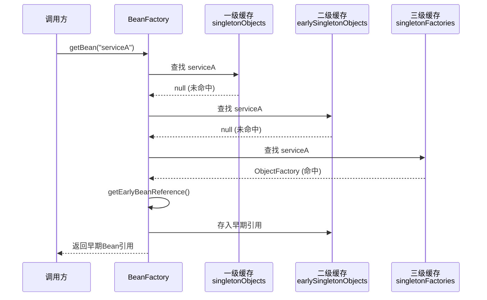
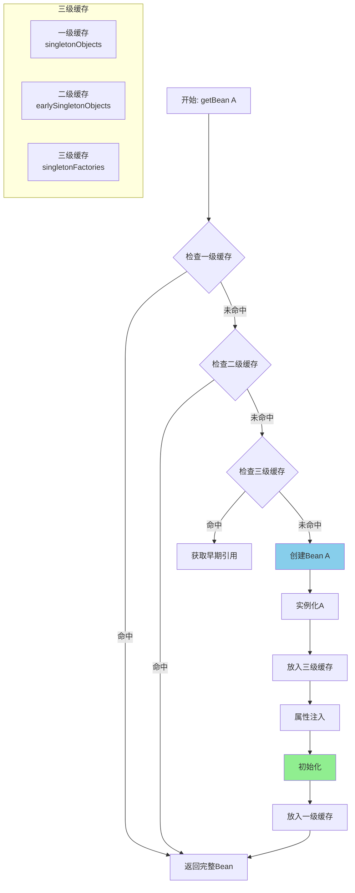
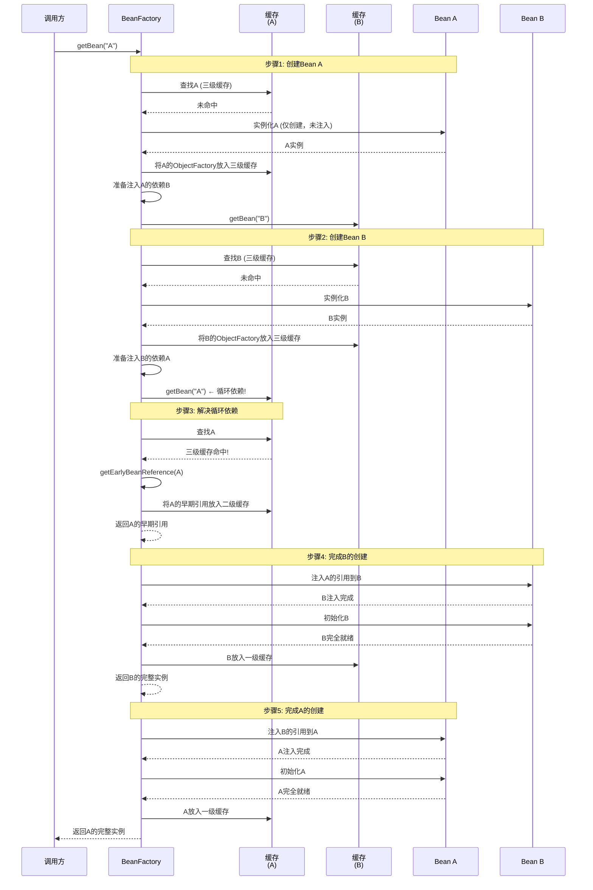
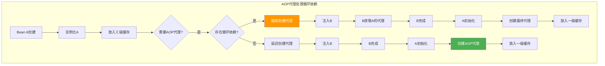
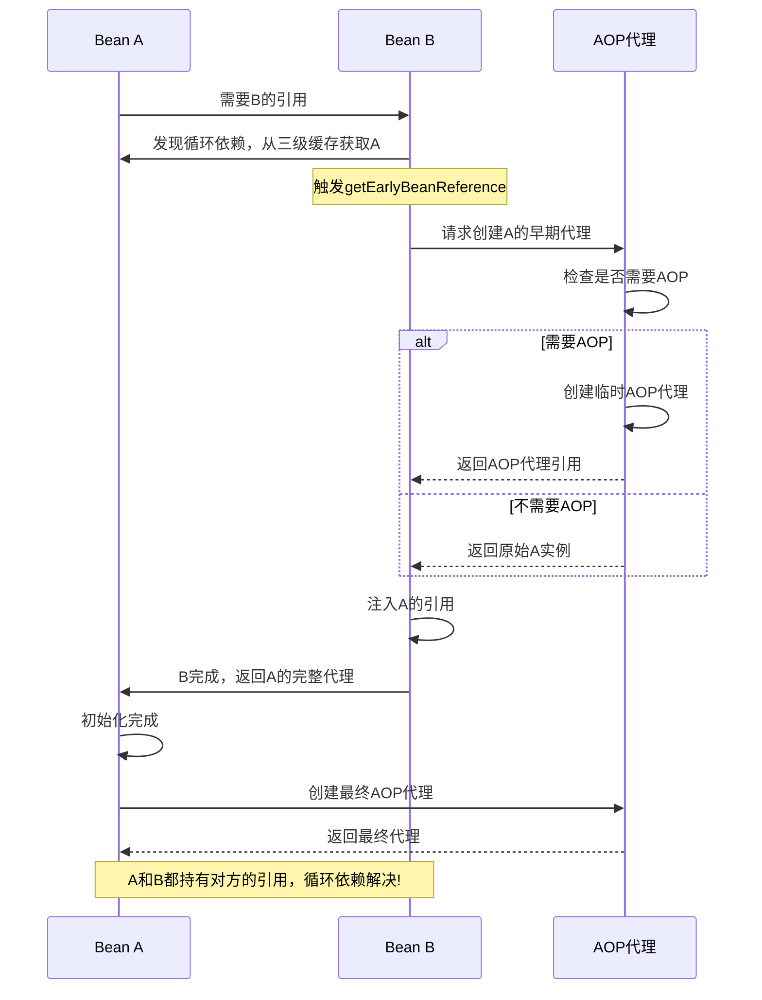
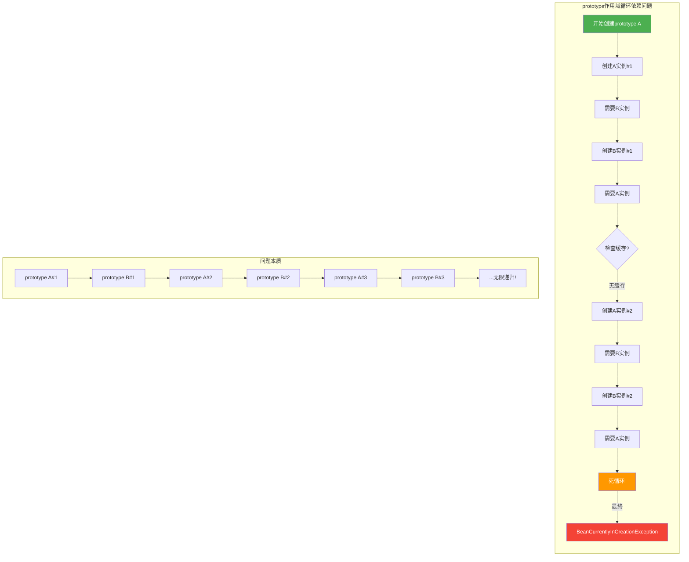

# Spring 循环依赖机制图解

> 详细解析Spring IoC容器通过三级缓存解决循环依赖的完整流程

---

## 目录

- [1. 循环依赖问题概述](#1-循环依赖问题概述)
- [2. 三级缓存架构设计](#2-三级缓存架构设计)
- [3. 核心处理流程详解](#3-核心处理流程详解)
- [4. AOP代理处理流程](#4-aop代理处理流程)
- [5. 不同作用域处理差异](#5-不同作用域处理差异)
- [6. 源码级深度解析](#6-源码级深度解析)
- [7. 最佳实践与常见问题](#7-最佳实践与常见问题)

---

## 1. 循环依赖问题概述

### 1.1 什么是循环依赖？

```
┌─────────────────────────────────────────────────────────────────────┐
│                        循环依赖示例                                   │
├─────────────────────────────────────────────────────────────────────┤
│                                                                     │
│  Bean A ──依赖──► Bean B                                            │
│    ▲                  │                                             │
│    │                  │                                             │
│    └────依赖──────────┘                                             │
│                                                                     │
│  代码示例:                                                           │
│  @Service                                                           │
│  public class ServiceA {                                            │
│      @Autowired                                                    │
│      private ServiceB serviceB;  // 依赖 B                          │
│  }                                                                  │
│                                                                     │
│  @Service                                                           │
│  public class ServiceB {                                            │
│      @Autowired                                                    │
│      private ServiceA serviceA;  // 依赖 A ← 循环！                 │
│  }                                                                  │
│                                                                     │
│  问题: Spring 创建 A 需要 B，创建 B 需要 A，形成死锁               │
│                                                                     │
└─────────────────────────────────────────────────────────────────────┘
```

### 1.2 Spring Bean 生命周期三阶段

```
┌─────────────────────────────────────────────────────────────────────┐
│                    Spring Bean 生命周期三阶段                          │
├─────────────────────────────────────────────────────────────────────┤
│                                                                     │
│  ┌─────────────────────────────────────────────────────────────┐   │
│  │                    Bean 创建流程                               │   │
│  └─────────────────────────────────────────────────────────────┘   │
│                                                                     │
│  阶段1: 实例化 (Instantiation)                                       │
│  ┌─────────────────────────────────────────────────────────────┐   │
│  │  通过反射创建Bean实例                                        │   │
│  │  Object bean = beanClass.getDeclaredConstructor().newInstance() │   │
│  │  → 此时Bean只有基本结构，依赖字段为null                      │   │
│  └─────────────────────────────────────────────────────────────┘   │
│                           │                                         │
│                           ▼                                         │
│  阶段2: 属性注入 (PopulateProperties)                                │
│  ┌─────────────────────────────────────────────────────────────┐   │
│  │  解析@Autowired/@Resource等注解                              │   │
│  │  注入依赖的Bean引用                                         │   │
│  │  → 此时需要递归创建依赖的Bean                                │   │
│  └─────────────────────────────────────────────────────────────┘   │
│                           │                                         │
│                           ▼                                         │
│  阶段3: 初始化 (Initialization)                                      │
│  ┌─────────────────────────────────────────────────────────────┐   │
│  │  调用@PostConstruct方法                                      │   │
│  │  调用InitializingBean.afterPropertiesSet()                  │   │
│  │  执行自定义init-method                                       │   │
│  │  AOP代理创建                                                │   │
│  │  → 此时Bean完全就绪                                         │   │
│  └─────────────────────────────────────────────────────────────┘   │
│                                                                     │
└─────────────────────────────────────────────────────────────────────┘
```

---

## 2. 三级缓存架构设计

### 2.1 缓存结构图解

```mermaid
graph TB
    subgraph "三级缓存架构"
        direction TB
        subgraph "一级缓存: singletonObjects"
            A1[已完全初始化的Bean实例]
            A2[Key: beanName]
            A3[Value: 完整Bean对象]
            A1 --- A2 --- A3
        end
        
        subgraph "二级缓存: earlySingletonObjects"
            B1[提前暴露的半成品Bean]
            B2[Key: beanName]
            B3[Value: Bean对象引用]
            B1 --- B2 --- B3
        end
        
        subgraph "三级缓存: singletonFactories"
            C1[对象工厂 ObjectFactory]
            C2[Key: beanName]
            C3[Value: lambda/ObjectFactory]
            C1 --- C2 --- C3
        end
    end
    
    subgraph "缓存读取顺序"
        direction LR
        Read[获取Bean请求] --> Check1{检查一级缓存?}
        Check1 -- "命中" --> Return1[返回完整Bean]
        Check1 -- "未命中" --> Check2{检查二级缓存?}
        Check2 -- "命中" --> Return2[返回半成品Bean]
        Check2 -- "未命中" --> Check3{检查三级缓存?}
        Check3 -- "命中" --> CreateEarly[创建早期引用]
        CreateEarly --> Return2
        Check3 -- "未命中" --> CreateNew[创建新Bean]
    end
    
    style A1 fill:#4CAF50,color:#fff
    style B1 fill:#FF9800,color:#fff
    style C1 fill:#2196F3,color:#fff
```



### 2.2 三级缓存详细说明

```
┌─────────────────────────────────────────────────────────────────────┐
│                    三级缓存详细说明                                    │
├─────────────────────────────────────────────────────────────────────┤
│                                                                     │
│  ┌─────────────────────────────────────────────────────────────┐   │
│  │ 一级缓存: singletonObjects (ConcurrentHashMap)              │   │
│  │ ─────────────────────────────────────────────────────────── │   │
│  │ 存储内容: 完全初始化的Bean实例                               │   │
│  │ 生命周期: Bean完全创建后放入                                │   │
│  │ 访问速度: 最快 (直接返回)                                   │   │
│  │ 作用: 避免重复创建，保证单例唯一性                          │   │
│  │                                                             │   │
│  │  [ServiceA完整实例] ← singletonObjects.get("serviceA")     │   │
│  └─────────────────────────────────────────────────────────────┘   │
│                                                                     │
│  ┌─────────────────────────────────────────────────────────────┐   │
│  │ 二级缓存: earlySingletonObjects (HashMap)                   │   │
│  │ ─────────────────────────────────────────────────────────── │   │
│  │ 存储内容: 提前暴露的Bean引用 (可能是AOP代理)                │   │
│  │ 生命周期: 解决循环依赖时临时放入                           │   │
│  │ 访问速度: 较快 (直接返回引用)                               │   │
│  │ 作用: 快速获取已创建但未初始化完成的Bean                   │   │
│  │                                                             │   │
│  │  [ServiceA早期引用/代理] ← earlySingletonObjects.get(...)  │   │
│  └─────────────────────────────────────────────────────────────┘   │
│                                                                     │
│  ┌─────────────────────────────────────────────────────────────┐   │
│  │ 三级缓存: singletonFactories (HashMap)                      │   │
│  │ ─────────────────────────────────────────────────────────── │   │
│  │ 存储内容: ObjectFactory (创建Bean的工厂方法)                │   │
│  │ 生命周期: Bean实例化后立即放入                              │   │
│  │ 访问速度: 需调用工厂方法                                    │   │
│  │ 作用: 延迟创建AOP代理，支持循环依赖时的灵活处理              │   │
│  │                                                             │   │
│  │  [() -> getEarlyBeanReference("serviceA")]                  │   │
│  └─────────────────────────────────────────────────────────────┘   │
│                                                                     │
└─────────────────────────────────────────────────────────────────────┘
```

### 2.3 缓存交互流程图



---

## 3. 核心处理流程详解

### 3.1 无循环依赖流程



### 3.2 循环依赖完整流程（A依赖B，B依赖A）



### 3.3 循环依赖处理状态流转图

```
┌─────────────────────────────────────────────────────────────────────┐
│                    循环依赖处理状态流转                                 │
├─────────────────────────────────────────────────────────────────────┤
│                                                                     │
│  Bean A 创建流程:                                                    │
│  ┌─────────┐    ┌─────────┐    ┌─────────┐    ┌─────────┐         │
│  │ 实例化A  │───►│ 放入三级 │───►│ 注入B    │───►│ 等待B   │         │
│  │         │    │ 缓存    │    │         │    │ 返回A引用│         │
│  └─────────┘    └─────────┘    └─────────┘    └─────────┘         │
│                                                     │               │
│                                                     ▼               │
│                                              ┌─────────┐            │
│                                              │ A就绪?   │            │
│                                              └────┬────┘            │
│                                           是    │     │ 否          │
│                                            │    │     │ (B先完成)    │
│                                            ▼    │     ▼               │
│  ┌─────────┐    ┌─────────┐    ┌─────────┐    │  ┌─────────┐      │
│  │ A注入B   │◄───│ B注入A   │◄───│ 创建B   │◄───┘  │ B就绪   │      │
│  │ 完成    │    │         │    │         │       │         │      │
│  └─────────┘    └─────────┘    └─────────┘       └─────────┘      │
│       │                                                          │
│       ▼                                                          │
│  ┌─────────┐    ┌─────────┐                                      │
│  │ 初始化A  │───►│ 放入一级 │───► 完成!                            │
│  │         │    │ 缓存    │                                      │
│  └─────────┘    └─────────┘                                      │
│                                                                     │
└─────────────────────────────────────────────────────────────────────┘
```

---

## 4. AOP代理处理流程

### 4.1 AOP代理与循环依赖



### 4.2 getEarlyBeanReference 详解

```
┌─────────────────────────────────────────────────────────────────────┐
│              getEarlyBeanReference 执行时机                           │
├─────────────────────────────────────────────────────────────────────┤
│                                                                     │
│  触发条件:                                                           │
│  1. 从三级缓存获取ObjectFactory时                                   │
│  2. 需要提前暴露Bean引用给其他Bean                                  │
│  3. 可能是AOP代理对象                                               │
│                                                                     │
│  执行流程:                                                           │
│  ┌─────────────────────────────────────────────────────────────┐   │
│  │                                                             │   │
│  │  protected Object getEarlyBeanReference(String beanName,     │   │
│  │                                           Object bean,      │   │
│  │                                           RootBeanDefinition mbd) { │   │
│  │      // 1. 获取SmartInstantiationAwareBeanPostProcessor列表  │   │
│  │      Object exposedObject = bean;                           │   │
│  │      for (SmartInstantiationAwareBeanPostProcessor bp : ...) { │   │
│  │          // 2. 调用getEarlyBeanReference方法                │   │
│  │          exposedObject = bp.getEarlyBeanReference(           │   │
│  │              exposedObject, beanName, mbd, null, null);     │   │
│  │      }                                                      │   │
│  │      return exposedObject;  // 返回可能的AOP代理             │   │
│  │  }                                                          │   │
│  │                                                             │   │
│  └─────────────────────────────────────────────────────────────┘   │
│                                                                     │
│  SmartInstantiationAwareBeanPostProcessor作用:                       │
│  ┌─────────────────────────────────────────────────────────────┐   │
│  │ 接口方法: getEarlyBeanReference()                           │   │
│  │                                                             │   │
│  │ 作用:                                                       │   │
│  │ - 在循环依赖场景下，提前创建AOP代理                         │   │
│  │ - 避免依赖方拿到原始对象而非代理                            │   │
│  │ - 确保AOP功能正常工作                                       │   │
│  │                                                             │   │
│  │ 实现类:                                                     │   │
│  │ - AbstractAutoProxyCreator                                  │   │
│  │ - 内部调用wrapIfNecessary创建代理                           │   │
│  └─────────────────────────────────────────────────────────────┘   │
│                                                                     │
└─────────────────────────────────────────────────────────────────────┘
```

### 4.3 AOP代理处理时序图



---

## 5. 不同作用域处理差异

### 5.1 作用域对比表

| 作用域 | 是否支持循环依赖 | 处理方式 | 失败异常 |
|--------|-----------------|----------|----------|
| **singleton** | ✅ 支持 | 三级缓存提前暴露 | BeanCurrentlyInCreationException |
| **prototype** | ❌ 不支持 | 无缓存机制 | BeanCurrentlyInCreationException |
| **request** | ❌ 不支持 | 类似prototype | BeanCurrentlyInCreationException |
| **session** | ❌ 不支持 | 类似prototype | BeanCurrentlyInCreationException |

### 5.2 作用域处理差异图解

```
┌─────────────────────────────────────────────────────────────────────┐
│                    不同作用域循环依赖处理                              │
├─────────────────────────────────────────────────────────────────────┤
│                                                                     │
│  singleton 作用域:                                                  │
│  ┌─────────────────────────────────────────────────────────────┐   │
│  │                                                             │   │
│  │  Bean A ──► 放入三级缓存 ──► Bean B ──► 从三级获取A引用     │   │
│  │                                    │                       │   │
│  │                                    ▼                        │   │
│  │                              Bean B完成                     │   │
│  │                                    │                       │   │
│  │                                    ▼                        │   │
│  │                              Bean A完成                     │   │
│  │                                    │                       │   │
│  │                                    ▼                        │   │
│  │                              双方完成，循环依赖解决!         │   │
│  │                                                             │   │
│  │  关键: singleton支持提前暴露引用                             │   │
│  └─────────────────────────────────────────────────────────────┘   │
│                                                                     │
│  prototype 作用域:                                                  │
│  ┌─────────────────────────────────────────────────────────────┐   │
│  │                                                             │   │
│  │  Bean A(新) ──► 需要B ──► Bean B(新) ──► 需要A              │   │
│  │                                                  │          │   │
│  │                                                  ▼          │   │
│  │                                         Bean A还在创建中!   │   │
│  │                                                  │          │   │
│  │                                                  ▼          │   │
│  │                                         ❌ 无法获取A引用    │   │
│  │                                                  │          │   │
│  │                                                  ▼          │   │
│  │                              抛出BeanCurrentlyInCreationException │
│  │                                                             │   │
│  │  关键: prototype每次创建新实例，不支持缓存                     │   │
│  └─────────────────────────────────────────────────────────────┘   │
│                                                                     │
└─────────────────────────────────────────────────────────────────────┘
```

### 5.3 prototype为什么不支持循环依赖？



---

## 6. 源码级深度解析

### 6.1 getBean核心流程（伪代码）

> ⚠️ 以下为简化伪代码，展示核心逻辑

```java
// AbstractAutowireCapableBeanFactory#doGetBean
protected <T> T doGetBean(final String name, final Class<T> requiredType,
                          final Object[] args, boolean typeCheckOnly) throws BeansException {
    
    // 步骤1: 从缓存获取Bean
    // 实际调用: getSingleton(name) → 依次检查三级缓存
    Object sharedInstance = getSingleton(name);
    
    if (sharedInstance != null) {
        // 缓存命中，直接返回
        return (T) getObjectForBeanInstance(sharedInstance, name, ...);
    }
    
    // 步骤2: 缓存未命中，创建Bean
    try {
        // 标记Bean正在创建（加入singletonsCurrentlyInCreation集合）
        beforePrototypeCreation(beanName);
        
        // 关键: createBean内部会调用doCreateBean
        // doCreateBean中会执行addSingletonFactory
        Object bean = createBean(beanName, mbd, args);
        
        // ... Bean创建完成后处理
        afterPrototypeCreation(beanName);
        
        // 将Bean放入一级缓存
        registerSingleton(beanName, bean);
        
    } catch (BeansException ex) {
        // 清理创建状态
        cleanupAfterCreationFailure(beanName, ...);
        throw ex;
    }
    
    return (T) bean;
}
```

### 6.2 getSingleton方法实现（真实源码）

```java
// DefaultSingletonBeanRegistry#getSingleton
public Object getSingleton(String beanName) {
    return getSingleton(beanName, true);  // allowEarlyReference=true
}

protected Object getSingleton(String beanName, boolean allowEarlyReference) {
    
    // 一级缓存: 已完全初始化的Bean
    Object singletonObject = this.singletonObjects.get(beanName);
    
    if (singletonObject == null && isSingletonCurrentlyInCreation(beanName)) {
        // Bean正在创建中，查找二级缓存
        
        synchronized (this.singletonObjects) {
            // 二级缓存: 提前暴露的Bean引用
            singletonObject = this.earlySingletonObjects.get(beanName);
            
            if (singletonObject == null && allowEarlyReference) {
                // 三级缓存: ObjectFactory
                ObjectFactory<?> singletonFactory = this.singletonFactories.get(beanName);
                
                if (singletonFactory != null) {
                    // 调用ObjectFactory创建早期引用（可能触发AOP代理创建）
                    singletonObject = singletonFactory.getObject();
                    
                    // 关键: 从三级缓存升级到二级缓存
                    // 避免重复调用ObjectFactory.getObject()
                    this.earlySingletonObjects.put(beanName, singletonObject);
                    this.singletonFactories.remove(beanName);
                }
            }
        }
    }
    
    return singletonObject;
}
```

### 6.3 createBean与doCreateBean流程（核心）

```java
/**
 * 注意: 以下为简化流程说明，实际Spring源码更复杂
 * 
 * Bean创建的两个阶段:
 * 1. createBean: 外部入口，处理AOP代理的提前创建
 * 2. doCreateBean: 内部实现，处理实例化、注入、初始化
 */

// ========== createBean 阶段 ==========
protected Object createBean(String beanName, RootBeanDefinition mbd, Object[] args) {
    
    // 步骤1: 解析Bean类型、验证方法覆盖等
    
    // 步骤2: 如果需要，提前创建AOP代理
    // resolveBeforeInstantiation在createBeanInstance之前调用
    // 某些BeanPostProcessor可以在此处创建代理
    Object bean = resolveBeforeInstantiation(beanName, mbd);
    
    if (bean != null) {
        // 如果返回了代理对象，直接返回，不再执行doCreateBean
        // 这种情况不会触发循环依赖处理
        return bean;
    }
    
    // 步骤3: 正常流程，调用doCreateBean
    return doCreateBean(beanName, mbd, args);
}

// ========== doCreateBean 阶段 ==========
protected Object doCreateBean(String beanName, RootBeanDefinition mbd, Object[] args) {
    
    // ========== 第一阶段: 实例化 ==========
    
    // 步骤1: 创建Bean实例（反射创建对象）
    BeanWrapper instanceWrapper = createBeanInstance(beanName, mbd, args);
    Object bean = instanceWrapper.getWrappedInstance();
    
    // 步骤2: 判断是否需要提前暴露Bean引用
    // 条件: singleton + 允许循环依赖 + Bean正在创建中
    boolean earlySingletonExposure = (mbd.isSingleton() 
        && this.allowCircularReferences 
        && isSingletonCurrentlyInCreation(beanName));
    
    Object exposedObject = bean;
    
    // ========== 第二阶段: 属性注入 ==========
    
    // 步骤3: 提前暴露Bean引用（关键！）
    // 在属性注入之前，将ObjectFactory放入三级缓存
    // ObjectFactory会在getEarlyBeanReference中按需创建AOP代理
    if (earlySingletonExposure) {
        addSingletonFactory(beanName, () -> 
            getEarlyBeanReference(beanName, mbd, exposedObject)
        );
    }
    
    // 步骤4: 属性注入
    // populateBean内部处理@Autowired依赖
    // 如果发现循环依赖，会从三级缓存获取早期引用
    populateBean(beanName, mbd, instanceWrapper, args);
    
    // ========== 第三阶段: 初始化 ==========
    
    // 步骤5: 初始化Bean
    // 调用@PostConstruct、InitializingBean、自定义init-method
    exposedObject = initializeBean(beanName, exposedObject, mbd);
    
    // 步骤6: 处理循环依赖后的引用一致性
    if (earlySingletonExposure) {
        // 检查是否有其他Bean通过循环依赖获取了早期引用
        Object earlyReference = earlySingletonObjects.get(beanName);
        if (earlyReference != null 
            && earlyReference != exposedObject
            && !this.singletonObjects.containsKey(beanName)) {
            // 关键: 如果存在循环依赖，使用早期引用（可能是AOP代理）
            // 保证所有依赖方持有的是同一个对象
            exposedObject = earlyReference;
        }
    }
    
    return exposedObject;
}
```

### 6.4 二级缓存存在的必要性

```
┌─────────────────────────────────────────────────────────────────────┐
│                    为什么需要二级缓存？                                │
├─────────────────────────────────────────────────────────────────────┤
│                                                                     │
│  场景: A依赖B和C，B和C都依赖A                                        │
│                                                                     │
│  如果只有一级和三级缓存:                                              │
│  ┌─────────────────────────────────────────────────────────────┐   │
│  │                                                             │   │
│  │  1. 创建A → 放入三级缓存                                    │   │
│  │  2. B需要A → 从三级获取 → 调用getEarlyBeanReference          │   │
│  │     → 创建AOP代理proxy1                                    │   │
│  │  3. C需要A → 从三级获取 → 再次调用getEarlyBeanReference      │   │
│  │     → 创建AOP代理proxy2 (与proxy1不同!)                    │   │
│  │  4. B和C持有不同的代理对象 → 引用不一致!                    │   │
│  │                                                             │   │
│  │  ❌ 问题:                                                    │   │
│  │  - 重复调用ObjectFactory.getObject()                        │   │
│  │  - 创建多个AOP代理实例                                      │   │
│  │  - 引用不一致，可能导致问题                                 │   │
│  │                                                             │   │
│  └─────────────────────────────────────────────────────────────┘   │
│                                                                     │
│  有二级缓存的情况:                                                    │
│  ┌─────────────────────────────────────────────────────────────┐   │
│  │                                                             │   │
│  │  1. 创建A → 放入三级缓存                                    │   │
│  │  2. B需要A → 从三级获取 → 创建proxy1                        │   │
│  │     → 将proxy1放入二级缓存                                  │   │
│  │  3. C需要A → 检查二级缓存 → 直接获取proxy1                  │   │
│  │     → 不再调用getEarlyBeanReference                         │   │
│  │  4. B和C都持有proxy1 → 引用一致!                            │   │
│  │                                                             │   │
│  │  ✅ 优点:                                                    │   │
│  │  - 避免重复创建AOP代理                                      │   │
│  │  - 保证所有依赖方获取的是同一个引用                          │   │
│  │  - 提升性能（减少代理创建开销）                              │   │
│  │                                                             │   │
│  └─────────────────────────────────────────────────────────────┘   │
│                                                                     │
└─────────────────────────────────────────────────────────────────────┘
```

---

## 7. 最佳实践与常见问题

### 7.1 避免循环依赖的最佳实践

| 方案 | 说明 | 示例 |
|------|------|------|
| **延迟加载** | 使用`@Lazy`注解 | `@Lazy @Autowired private B b;` |
| **setter注入** | 使用setter代替构造器 | `public void setB(B b) { this.b = b; }` |
| **接口解耦** | 定义接口减少依赖 | A依赖BInterface，B实现BInterface |
| **事件驱动** | 使用Spring Event | A发布事件，B监听事件 |
| **重构逻辑** | 提取公共方法到第三方 | A和B都依赖C，而不是互相依赖 |

### 7.2 @Lazy解决方案

```java
// ServiceA.java
@Service
public class ServiceA {
    
    private final ServiceB serviceB;
    
    // 使用@Lazy实现延迟加载
    public ServiceA(@Lazy ServiceB serviceB) {
        this.serviceB = serviceB;
    }
    
    public void methodA() {
        // 第一次调用时才会初始化serviceB
        serviceB.methodB();
    }
}

// ServiceB.java
@Service
public class ServiceB {
    
    private final ServiceA serviceA;
    
    public ServiceB(ServiceA serviceA) {
        this.serviceA = serviceA;
    }
    
    public void methodB() {
        serviceA.methodA();
    }
}
```

### 7.3 常见问题FAQ

**Q1: 为什么Spring不推荐使用字段注入？**

```
A: 字段注入的问题:
   1. 无法声明不可变性 (final字段)
   2. 隐藏依赖关系
   3. 难以进行单元测试
   4. 可能掩盖循环依赖问题

推荐: 使用构造器注入
```

**Q2: 构造器注入如何解决循环依赖？**

```
A: 构造器注入场景:
   1. Spring不支持构造器注入的循环依赖
   2. 需要使用@Lazy延迟加载
   3. 或重构代码消除循环依赖

原因: 构造器注入要求构造时就获取依赖，而循环依赖时依赖尚未创建完成
```

**Q3: @Lazy的工作原理？**

```
A: @Lazy工作原理:
   1. 创建一个CGLIB代理对象替代真实Bean
   2. 代理对象在方法调用时才获取真实Bean
   3. 延迟了Bean的初始化时机
   4. 打破了构造器注入的循环

时序:
   A构造器 → 获取B的代理(不真正创建B) → A完成
   B构造器 → 获取A实例(A已完成) → B完成
   A.method() → 通过代理获取B的真实实例 → 调用B.method()
```

**Q4: 如何诊断循环依赖问题？**

```
A: 诊断步骤:
   1. 查看异常信息: BeanCurrentlyInCreationException
   2. 查看异常中的循环依赖链
   3. 分析依赖关系图
   4. 确定循环依赖的Bean
   5. 选择合适的解决方案

异常示例:
   Error creating bean with name 'serviceA': 
   Requested bean is currently in creation: 
   Is there an unresolvable circular reference?
   
   依赖链: serviceA → serviceB → serviceA
```

### 7.4 循环依赖解决方案决策树

```mermaid
flowchart TD
    Start[发现循环依赖] --> CheckType{检查注入方式}
    
    CheckType -- "字段注入" --> CheckScope{检查作用域}
    CheckType -- "构造器注入" --> LazySolution[使用@Lazy注解]
    
    CheckScope -- "singleton" --> CheckLevel{检查依赖层级}
    CheckScope -- "prototype" --> Refactor[必须重构代码]
    
    CheckLevel -- "2个Bean" --> SpringSolution[Spring三级缓存自动解决]
    CheckLevel -- "3+个Bean" --> DesignReview[审查设计是否合理]
    
    SpringSolution --> CheckAOP{有AOP代理?}
    CheckAOP -- "是" --> AOPCheck[确认代理对象正确创建]
    CheckAOP -- "否" --> Done[问题已解决]
    
    DesignReview --> Restructure[重构代码结构]
    Restructure --> InterfaceSplit[使用接口解耦]
    
    subgraph "推荐方案"
        direction LR
        P1[1. 延迟加载] --> P2[2. 接口解耦] --> P3[3. 事件驱动]
    end
    
    style Start fill:#4CAF50,color:#fff
    style Done fill:#4CAF50,color:#fff
    style Refactor fill:#f44336,color:#fff
```

---

## 附录：核心概念速查表

| 概念 | 说明 | 存储位置 |
|------|------|----------|
| **三级缓存** | singletonFactories | ObjectFactory lambda |
| **二级缓存** | earlySingletonObjects | 提前暴露的Bean引用 |
| **一级缓存** | singletonObjects | 完全初始化的Bean |
| **getEarlyBeanReference** | 创建AOP代理 | AbstractAutowireCapableBeanFactory |
| **SmartInstantiationAwareBeanPostProcessor** | 控制早期代理 | Spring AOP核心接口 |

---

## 总结

Spring通过**三级缓存机制**优雅地解决了单例Bean的循环依赖问题：

1. **实例化阶段**：创建Bean实例后立即放入三级缓存
2. **注入阶段**：如果依赖的Bean正在创建，从三级缓存获取早期引用
3. **初始化阶段**：Bean完全就绪后升级到一级缓存

**关键要点**：
- singleton作用域支持循环依赖（三级缓存）
- prototype作用域不支持循环依赖
- 构造器注入不支持循环依赖（需@Lazy）
- AOP代理在循环依赖时会提前创建

> **文档版本**: v1.0  
> **适用对象**: Spring框架面试复习/技术文档  
> **更新日期**: 2026-07-29