# Spring 事务管理核心组件与设计模式深度解析

## 目录

1. [概述](#1-概述)
2. [@Transactional 注解](#2-transactional-注解)
3. [Spring 代理机制](#3-spring-代理机制)
4. [TransactionManager 事务管理器](#4-transactionmanager-事务管理器)
5. [TransactionSynchronization 事务同步机制](#5-transactionsynchronization-事务同步机制)
6. [DataSource 数据源](#6-datasource-数据源)
7. [@TransactionalEventListener 事务事件监听器](#7-transactionaleventlistener-事务事件监听器)
8. [原型模式与 ObjectFactory 接口](#8-原型模式与-objectfactory-接口)
9. [整体架构协作流程](#9-整体架构协作流程)

---

## 1. 概述

Spring 事务管理是 Spring 框架最核心的特性之一，它提供了声明式和编程式两种事务管理方式，帮助开发者在不侵入业务代码的前提下实现可靠的事务控制。

### 核心组件关系图

```mermaid
graph TB
    A[客户端请求] --> B[Spring AOP 代理]
    B --> C[@Transactional 注解]
    C --> D[TransactionInterceptor]
    D --> E[TransactionManager]
    E --> F[DataSource]
    F --> G[(数据库)]
    
    D --> H[TransactionSynchronizationManager]
    H --> I[TransactionSynchronization]
    I --> J[@TransactionalEventListener]
    
    E --> K[TransactionStatus]
    K --> L[TransactionDefinition]
    
    style A fill:#f9f,stroke:#333,stroke-width:2px
    style G fill:#ccf,stroke:#333,stroke-width:2px
```

---

## 2. @Transactional 注解

### 2.1 定义与作用

`@Transactional` 是 Spring 提供的**声明式事务管理**注解，通过 AOP 机制自动为标注方法创建事务边界，实现事务的开启、提交和回滚。

### 2.2 核心属性

| 属性 | 类型 | 默认值 | 说明 |
|------|------|--------|------|
| `value` | String | "" | 指定事务管理器 Bean 名称 |
| `transactionManager` | String | "" | 同 value，更具语义化 |
| `propagation` | Propagation | REQUIRED | 事务传播行为 |
| `isolation` | Isolation | DEFAULT | 事务隔离级别 |
| `timeout` | int | -1 | 事务超时时间（秒） |
| `readOnly` | boolean | false | 是否只读事务 |
| `rollbackFor` | Class<? extends Throwable>[] | {} | 指定需要回滚的异常类型 |
| `rollbackForClassName` | String[] | {} | 指定需要回滚的异常类名 |
| `noRollbackFor` | Class<? extends Throwable>[] | {} | 指定不需要回滚的异常类型 |
| `noRollbackForClassName` | String[] | {} | 指定不需要回滚的异常类名 |

### 2.3 事务传播行为（Propagation）

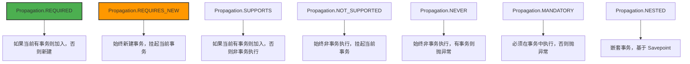

### 2.4 事务隔离级别（Isolation）

| 隔离级别 | 说明 | 脏读 | 不可重复读 | 幻读 |
|----------|------|------|-----------|------|
| `DEFAULT` | 使用数据库默认隔离级别 | - | - | - |
| `READ_UNCOMMITTED` | 允许读取未提交的数据 | 可能 | 可能 | 可能 |
| `READ_COMMITTED` | 只允许读取已提交的数据 | 不可能 | 可能 | 可能 |
| `REPEATABLE_READ` | 保证同一事务内多次读取相同 | 不可能 | 不可能 | 可能 |
| `SERIALIZABLE` | 最高隔离级别，串行执行 | 不可能 | 不可能 | 不可能 |

---

## 3. Spring 代理机制

### 3.1 工作原理

Spring 通过**动态代理**机制实现 `@Transactional` 的 AOP 切面增强。当调用标注了 `@Transactional` 的方法时，实际执行的是代理对象的方法，代理对象在目标方法执行前后添加事务管理逻辑。

### 3.2 代理类型

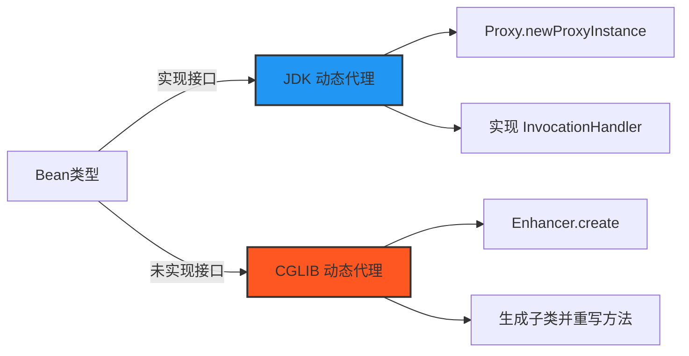

### 3.3 代理执行流程

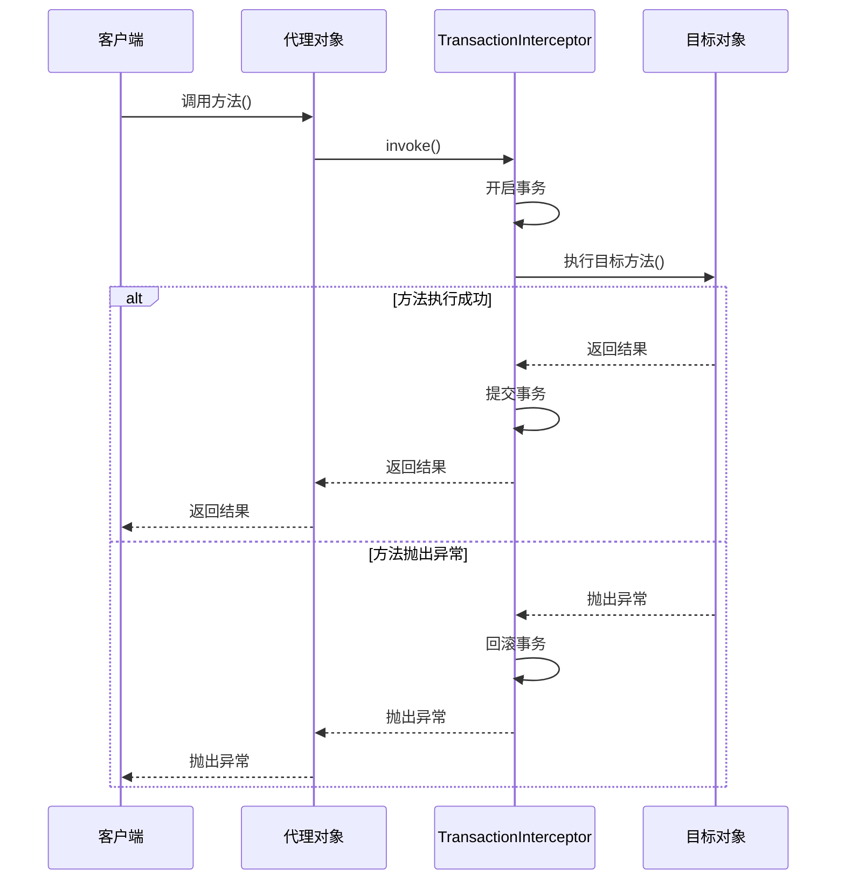

### 3.4 代理失效场景

| 场景 | 原因 | 解决方案 |
|------|------|----------|
| 同一类内自调用 | 绕过代理对象 | 注入自身代理或使用 AopContext |
| private/final 方法 | 无法被代理重写 | 修改为 public 且非 final |
| 静态方法 | 不属于实例方法 | 改用实例方法 |

---

## 4. TransactionManager 事务管理器

### 4.1 定义与作用

`TransactionManager` 是 Spring 事务管理的**核心接口**，负责管理事务的生命周期（开启、提交、回滚），是事务管理的实际执行者。

### 4.2 接口体系

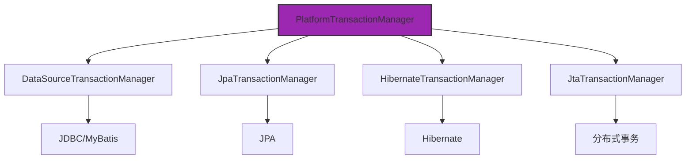

### 4.3 核心接口方法

```java
public interface PlatformTransactionManager {
    // 获取事务状态（开启事务）
    TransactionStatus getTransaction(TransactionDefinition definition) 
        throws TransactionException;
    
    // 提交事务
    void commit(TransactionStatus status) throws TransactionException;
    
    // 回滚事务
    void rollback(TransactionStatus status) throws TransactionException;
}
```

### 4.4 事务状态（TransactionStatus）

`TransactionStatus` 代表当前事务的状态，包含以下信息：

| 方法 | 说明 |
|------|------|
| `isNewTransaction()` | 是否为新事务 |
| `hasSavepoint()` | 是否有保存点 |
| `isRollbackOnly()` | 是否标记为回滚 |
| `setRollbackOnly()` | 标记为回滚 |
| `isCompleted()` | 事务是否已完成 |

---

## 5. TransactionSynchronization 事务同步机制

### 5.1 定义与作用

`TransactionSynchronization` 是 Spring 提供的**事务同步回调接口**，允许在事务的不同阶段注册回调函数，实现事务生命周期的事件监听。

### 5.2 生命周期回调

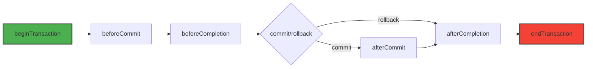

### 5.3 核心接口方法

```java
public interface TransactionSynchronization {
    int STATUS_COMMITTED = 0;
    int STATUS_ROLLED_BACK = 1;
    int STATUS_UNKNOWN = 2;
    
    // 事务提交前调用
    default void beforeCommit(boolean readOnly) {}
    
    // 事务完成前调用（提交或回滚）
    default void beforeCompletion() {}
    
    // 事务提交后调用
    default void afterCommit() {}
    
    // 事务完成后调用（提交或回滚）
    default void afterCompletion(int status) {}
    
    // 挂起事务时调用
    default void suspend() {}
    
    // 恢复事务时调用
    default void resume() {}
}
```

### 5.4 注册方式

```java
// 方式一：手动注册
TransactionSynchronizationManager.registerSynchronization(
    new TransactionSynchronization() {
        @Override
        public void afterCommit() {
            // 事务提交后执行
            logService.recordAuditLog();
        }
    }
);

// 方式二：使用适配器类（Spring 5.3+ 已废弃，不推荐使用）
// TransactionSynchronizationAdapter 在 Spring 5.3+ 已标记为 @Deprecated
// 推荐直接实现 TransactionSynchronization 接口（已有 default 方法）
TransactionSynchronizationManager.registerSynchronization(
    new TransactionSynchronizationAdapter() {
        @Override
        public void afterCommit() {
            logService.recordAuditLog();
        }
    }
);
```

> **注意**：`TransactionSynchronizationAdapter` 在 Spring 5.3+ 已标记为 `@Deprecated`，推荐直接实现 `TransactionSynchronization` 接口，该接口已提供所有方法的 default 实现。

---

## 6. DataSource 数据源

### 6.1 定义与作用

`DataSource` 是数据库连接的抽象接口，负责提供数据库连接（`Connection`），是事务管理的底层资源。

### 6.2 与事务管理器的关系

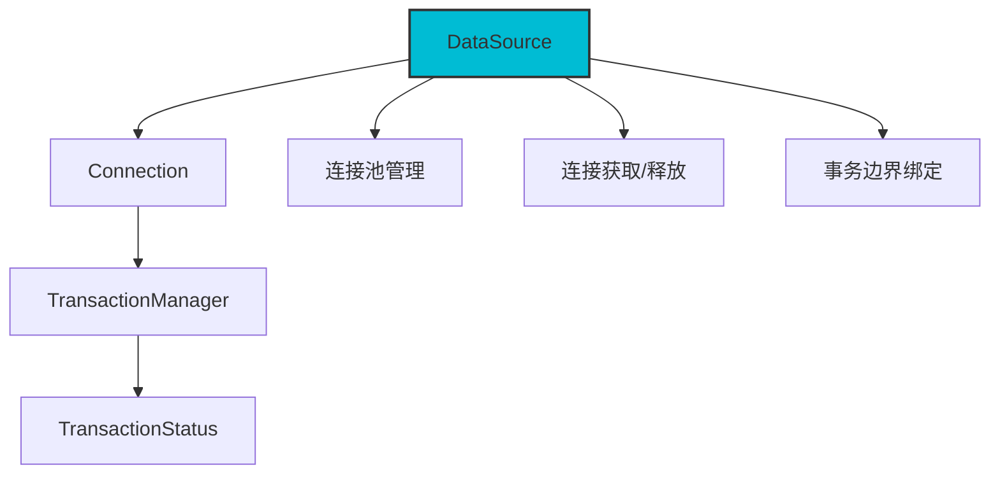

### 6.3 事务与连接的绑定

Spring 通过 `TransactionSynchronizationManager` 将数据库连接绑定到当前线程：

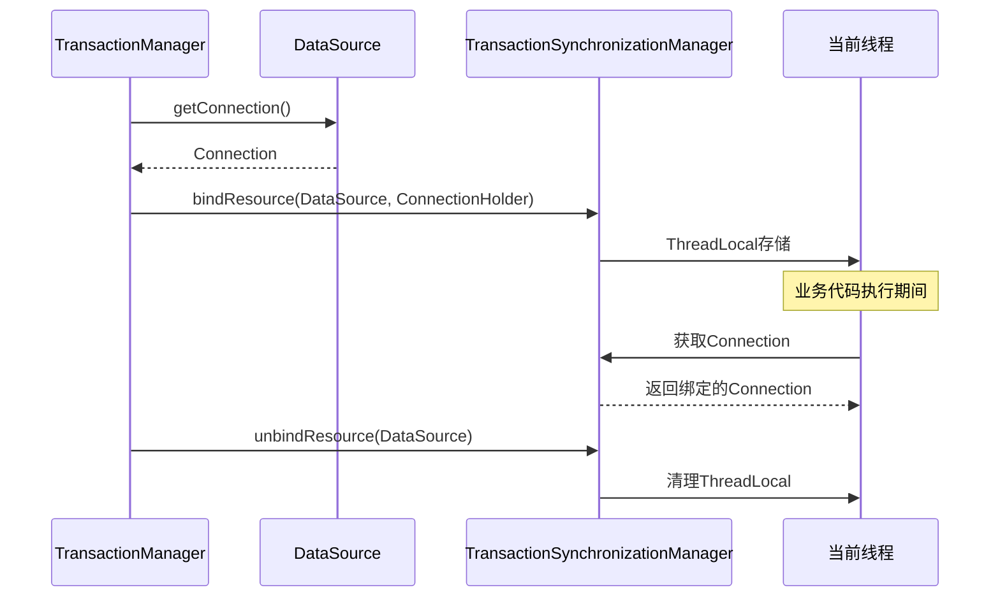

---

## 7. @TransactionalEventListener 事务事件监听器

### 7.1 定义与作用

`@TransactionalEventListener` 是 Spring 4.2+ 引入的**事务感知事件监听器**，允许事件处理与事务生命周期关联，实现事务提交后/回滚后执行特定逻辑。

### 7.2 事务阶段配置

```java
@TransactionalEventListener(phase = TransactionPhase.AFTER_COMMIT)
public void onOperationLogEvent(OperationLogEvent event) {
    // 事务提交后执行
}
```

| TransactionPhase | 说明 |
|------------------|------|
| `BEFORE_COMMIT` | 事务提交前 |
| `AFTER_COMMIT` | 事务提交后（默认） |
| `AFTER_ROLLBACK` | 事务回滚后 |
| `AFTER_COMPLETION` | 事务完成后（提交或回滚） |

### 7.3 执行流程

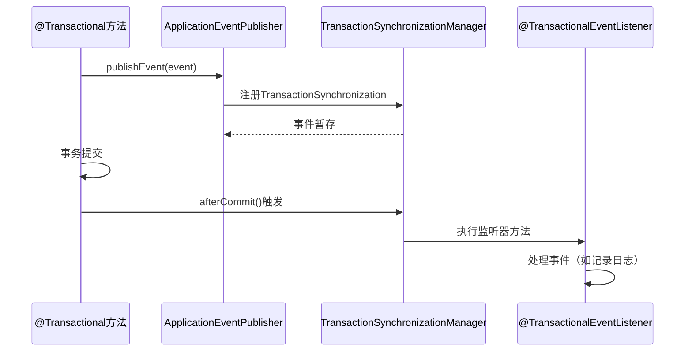

### 7.4 fallbackExecution 配置

```java
// fallbackExecution = false（默认）：无事务时不执行
@TransactionalEventListener(fallbackExecution = false)

// fallbackExecution = true：无事务时也执行
@TransactionalEventListener(fallbackExecution = true)
```

### 7.5 监听器方法的事务行为

**重要提示**：`@TransactionalEventListener` 本身**不会**为监听器方法创建事务。当监听器在 `AFTER_COMMIT` 阶段执行时，主事务已经提交，此时**没有活跃事务**。监听器中的数据库操作依赖于底层数据访问框架（如 MyBatis）的自动提交模式。

```mermaid
graph TD
    A[@Transactional方法] --> B[主事务执行]
    B --> C[事务提交]
    C --> D[@TransactionalEventListener]
    D --> E{监听器方法}
    
    E -->|无@Transactional| F[数据库自动提交模式]
    E -->|有@Transactional| G[新建独立事务]
    
    style F fill:#f44336,stroke:#333,stroke-width:2px
    style G fill:#4CAF50,stroke:#333,stroke-width:2px
```

**如需事务保护，必须显式添加 `@Transactional` 注解**：

```java
// 错误：监听器方法无事务保护
@TransactionalEventListener(phase = TransactionPhase.AFTER_COMMIT)
public void onOperationLogEvent(OperationLogEvent event) {
    operationLogMapper.insert(logEntity); // 依赖MyBatis自动提交
}

// 正确：显式添加事务注解，确保日志操作的原子性
@TransactionalEventListener(phase = TransactionPhase.AFTER_COMMIT)
@Transactional(propagation = Propagation.REQUIRES_NEW, rollbackFor = Exception.class)
public void onOperationLogEvent(OperationLogEvent event) {
    operationLogMapper.insert(logEntity); // 在独立事务中执行
}
```

> **关键区别**：
> - `@TransactionalEventListener`：控制监听器的**执行时机**（事务的哪个阶段）
> - `@Transactional`：控制监听器方法的**事务边界**（是否在事务中执行）

---

## 8. 原型模式与 ObjectFactory 接口

### 8.1 原型模式（Prototype Pattern）

在 Spring 中，原型模式通过**作用域**实现：

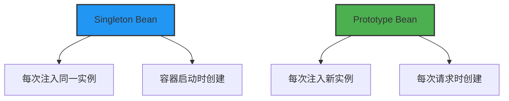

### 8.2 ObjectFactory 接口

`ObjectFactory` 是 Spring 提供的**对象工厂接口**，用于延迟获取 Bean 实例，是原型模式的核心组件。

```java
public interface ObjectFactory<T> {
    T getObject() throws BeansException;
}
```

### 8.3 应用场景：解决循环依赖

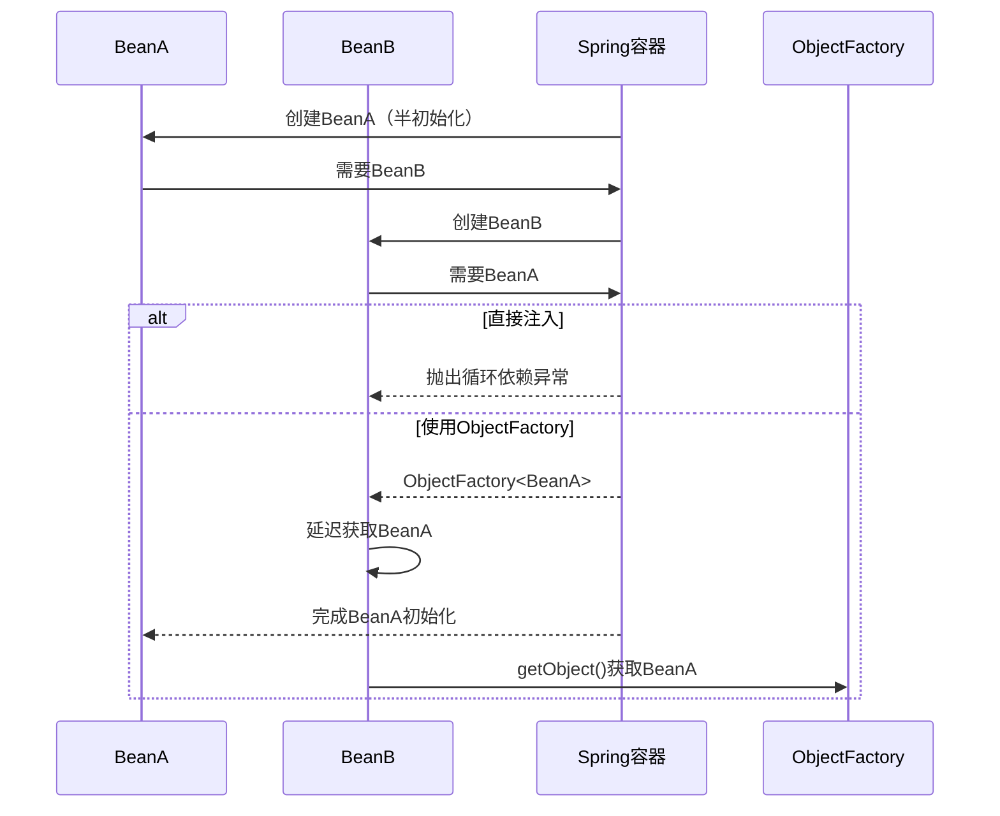

### 8.4 ObjectProvider 扩展

`ObjectProvider` 是 `ObjectFactory` 的扩展，提供更丰富的获取策略：

```java
// 获取实例，不存在则抛异常
T getObject();

// 获取实例，不存在则返回null
T getIfAvailable();

// 获取实例，不存在则返回默认值
T getIfAvailable(Supplier<T> defaultSupplier);

// 获取唯一实例，存在多个则抛异常
T getIfUnique();
```

---

## 9. 整体架构协作流程

### 9.1 完整时序图

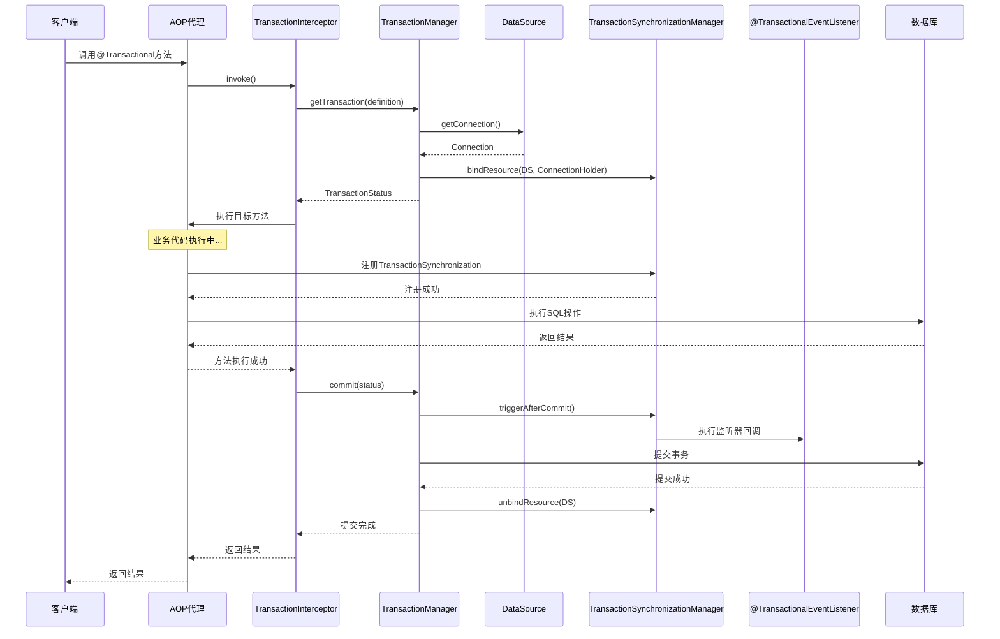

### 9.2 组件协作关系图

```mermaid
graph TB
    subgraph 应用层
        A[客户端请求] --> B[Controller]
        B --> C[Service]
    end
    
    subgraph AOP层
        C --> D[JDK/CGLIB代理]
        D --> E[TransactionInterceptor]
    end
    
    subgraph 事务管理层
        E --> F[PlatformTransactionManager]
        F --> G[DataSourceTransactionManager]
        E --> H[TransactionSynchronizationManager]
        H --> I[TransactionSynchronization]
        I --> J[@TransactionalEventListener]
    end
    
    subgraph 资源层
        G --> K[DataSource]
        K --> L[(数据库连接池)]
        L --> M[(数据库)]
    end
    
    subgraph 工厂层
        N[ObjectFactory] --> O[ObjectProvider]
        O --> P[Bean创建/获取]
    end
    
    style A fill:#f9f,stroke:#333,stroke-width:2px
    style M fill:#ccf,stroke:#333,stroke-width:2px
    style E fill:#ff9800,stroke:#333,stroke-width:2px
    style F fill:#9c27b0,stroke:#333,stroke-width:2px
```

---

## 附录：关键类与接口速查表

| 组件 | 接口/类 | 核心职责 |
|------|---------|----------|
| 声明式事务 | `@Transactional` | 标记事务方法 |
| 代理机制 | `JdkDynamicAopProxy` / `CglibAopProxy` | 创建代理对象 |
| 事务拦截器 | `TransactionInterceptor` | AOP 事务切面 |
| 事务管理器 | `PlatformTransactionManager` | 管理事务生命周期 |
| 事务状态 | `TransactionStatus` | 代表事务当前状态 |
| 事务定义 | `TransactionDefinition` | 事务属性定义 |
| 同步管理器 | `TransactionSynchronizationManager` | 管理线程绑定资源 |
| 同步回调 | `TransactionSynchronization` | 事务生命周期回调 |
| 事件监听器 | `@TransactionalEventListener` | 事务感知事件监听 |
| 对象工厂 | `ObjectFactory` / `ObjectProvider` | 延迟获取 Bean |
| 数据源 | `DataSource` | 提供数据库连接 |

---

**文档版本**: v1.0  
**生成时间**: 2026-07-21  
**适用范围**: Spring Framework 5.x / Spring Boot 2.x+